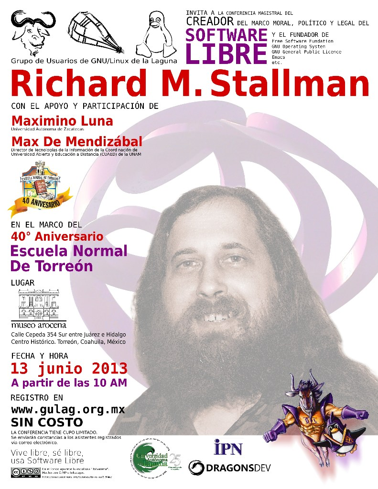

Richard Stallman en Torreón
===========

Fecha: 2013-06-01 01:12
Autor: Osvaldo
Categorías: Richard Stallman, GULAG, Coahuila

<!-- break -->

El [Grupo de Usuarios de GNU/Linux de la Laguna (GULAG)](http://www.gulag.org.mx/) hace una atenta invitación a las conferencias a realizarse el día 13 de junio del 2013 a partir de las 10:00 de la mañana, en la Plaza Peñoles del museo Arocena, cepeda 354 sur, en Torreón, Coahuila.

Las conferencias están orientadas a docentes y estudiantes de normal o educación, __pero de gran relevancia para los interesados en sistemas computacionales o informática__, por el nivel de los conferencistas que nos visitan:

### [Richard Stallman](https://es.wikipedia.org/wiki/Richard_Stallman)

* Egresado de Harvard de licenciatura en física, graduado en física en MIT y doctorados honoris causa en Suecia, Belgica, Perú, Argentina y otros países.
* Estando en preparatoria trabajó en el Centro Científico de la IBM
* Creador del concepto [Copyleft](https://es.wikipedia.org/wiki/Copyleft).
* Líder, creador de la cultura libre así como fundador del movimiento del software libre.
* Fundador de la [Free Software Fundation (FSF)](https://fsf.org/) y del proyecto [GNU (GNU is No Unix)](https://es.wikipedia.org/wiki/GNU).
* Defensor de la libertad, de que la educación, conocimiento y el software deben llegar a todo mundo, sin discriminación de edad, credo, situación económica, religiosa, geográfica, política o ideológica.
* Promotor de la soberanía tecnológica de los estados.

Richard Stallman dará una charla que llevará por nombre [_"El movimiento del Software Libre"_](https://www.fsf.org/events/20130613-torreon)

### [M. Max Ulises de Mendizábal Carrillo](https://twitter.com/MaxDeMendizbal)

Físico por parte de la Facultad de Ciencias de la UNAM y Máster Oficial de Software Libre por la Universidad Abierta de Cataluña. Actualmente es Director de Tecnologías de la Información de la [Coordinación de Universidad Abierta y Educación a Distancia (CUAED)](http://www.cuaed.unam.mx/portal/index.php) de la [UNAM](http://unam.mx/).

El título de su conferencia es ___"Moodle: software libre para un mejor futuro en la educación"___.

### M. Maximino Gerardo Luna Estrada

Responsable de informática y telecomunicaciones de la Unidad Académica en Estudios del Desarrollo de la Universidad Autónoma de Zacatecas y Secretario Técnico de la Red Internacional de Migración y Desarrollo. Nos hablará sobre el Software Estadístico que está creando.

A continuación una entrevista de Maximino Luna a Richard Stallman.

<iframe width="420" height="315" src="//www.youtube.com/embed/onrIApj3Cjs" frameborder="0" allowfullscreen></iframe>

 

Las conferencias, como todas las actividades que realiza el GULAG, serán gratuitas, abiertas al publico en general, cupo limitado, lo unico que tienen que hacer es registrarse en [http://www.gulag.org.mx](http://www.gulag.org.mx/).

Si conoces a alguien que le guste tanto la docencia como la informática y crees que pueda aprovechar la oportunidad de escuchar y preguntar a personas de talla internacional, por favor enviále esta información.

Por lo pronto te dejo con una nota publicada en el [Siglo de Torreón](http://www.elsiglodetorreon.com.mx/noticia/877341.participara-en-foro-de-reflexion-informatica.html) y un par de Megacable [aquí](https://www.youtube.com/watch?v=cZStvJ_pfqU) y [aquí](https://www.youtube.com/watch?v=4M-CjwnhhDc) y, sobre todo, te pido por favor leas el artículo ["_El derecho a leer_"](https://www.gnu.org/philosophy/right-to-read.es.html) de Richard M. Stallman.

Espero verte en este evento :)

 
