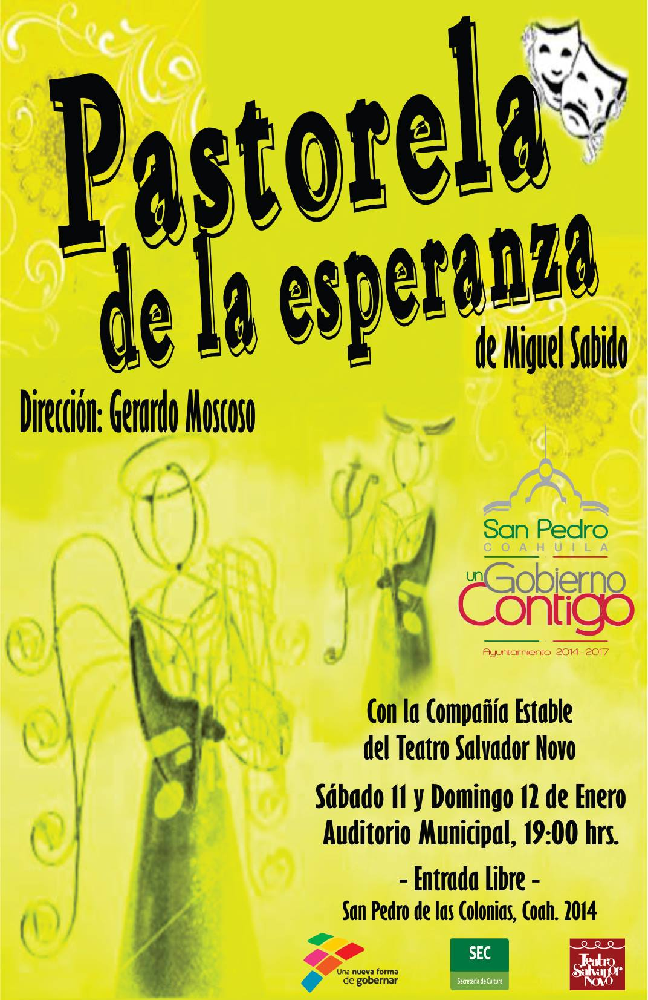

Pastorela de la esperanza - 2014 (I)
==================================

Fecha: 2014-01-18 00:04
Autor: Osvaldo
Categorías: Teatro

Por que el público así lo pide, continuamos con la presentación de la obra __"Pastorela de la esperanza"__ de Miguel Sabido, obra que es presentada bajo la dirección de [Gerardo Moscoso C.](http://companialagaviota.com/gerardo-moscoso/), con la brillante participación de 16 actores y actrices de todas las edades, y con un [servidor](https://salazarysanchez.github.io/contacto/contacto.html) como asistente de dirección y actuando.

<!-- break -->

Están invitados a disfrutar del tradicional formato de pastorela, algo surrealista como todas las pastorelas: la travesura de los diablillos, la inocencia de los pastores, un juego de futbol, música, baile y, sin olvidar, la reflexión sobre los problemas actuales.

La obra "Pastorela de la esperanza" se presentará en:

* Auditorio Municipal de San Pedro de las Colonias, Coahuila los dias 11 y 12 de enero del 2014 a las 19:00 horas.
* Teatro de la Ciudad \"Rogelio Montemayor\"; Matamoros, Coahuila, el día 18 de enero del 2014 a las 19:00 horas.
* [Teatro Salvador Novo](http://maps.google.com.mx/?ie=UTF8&ll=25.530493,-103.453193&spn=0.001142,0.001725&t=h&z=19); Torreón, Coahuila, el día 19 de enero del 2014 a las 19:00 horas.

En todas las funciones la entrada será gratuita.

__Los esperamos :)__
