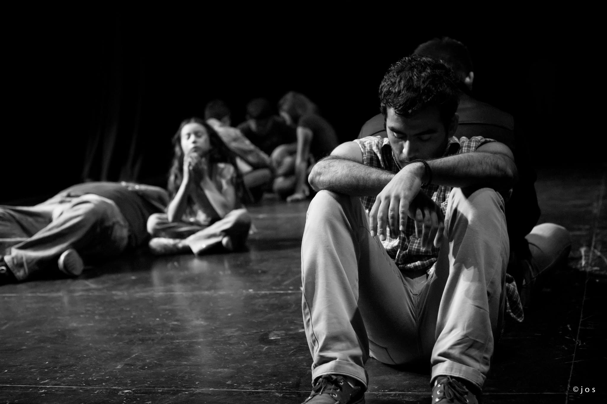

Día Mundial del Teatro 2014
==================================

Fecha: 2014-04-05 17:46
Autor: Osvaldo
Categorías: Teatro, Coahuila

El Día Mundial del Teatro fue creado en 1961 por el [Instituto Internacional del Teatro (ITI)](http://www.world-theatre-day.org/). Se celebra anualmente el 27 de marzo por los Centros ITI y la comunidad teatral internacional. Varios eventos teatrales nacionales e internacionales son organizados para conmemorar esta ocasión. Uno de los más importantes es la circulación del Mensaje Internacional del Día Mundial del Teatro a través del cual, por invitación del ITI, una figura de talla mundial comparte sus reflexiones sobre el tema del Teatro y una Cultura de Paz. El primer Mensaje Internacional del Día Mundial del Teatro fue escrito por Jean Cocteau (Francia) en 1962.

<!-- break -->

Desde entonces, cada año el 27 de marzo, el Día Mundial del Teatro se celebra en muchas y variadas formas por los Centros Nacionales del ITI de los cuales en la actualidad hay casi 100 en todo el mundo. Cada año, una figura sobresaliente en el teatro o una persona excepcional en corazón y espíritu de otro campo, es invitada a compartir sus reflexiones sobre el teatro y la armonía internacional. Lo que se conoce como el Mensaje Internacional se traduce en más de 20 idiomas, leído por decenas de miles de espectadores antes de las presentaciones en teatros de todo el mundo.

Con "El viaje de los cantores" hemos celebramos el Día Mundial del Teatro en el [Teatro Nazas (2010)](http://www.elsiglodetorreon.com.mx/noticia/511349.tendran-fiesta-por-dia-del-teatro.html) y en el Teatro Salvador Novo (2011 y 2012), y en éste [2014](http://www.elsiglodetorreon.com.mx/noticia/976564.el-teatro-de-fiesta-por-su-dia-mundial.html) lo hacemos nuevamente.

Con 30 actores en escena, un servidor tanto como asistente de Dirección como actor, todos bajo la dirección de Gerardo Moscoso C. celebraremos el día Mundial del Teatro el 27 de marzo a las 19:00 horas en el Teatro Salvador Novo (C. Galeana y prolongación Colón, En Torreón).

El Mensaje con motivo del Día Internacional del Teatro de este año, 2013, es redactado por [Brett Bailey](https://en.wikipedia.org/wiki/Brett_Bailey): dramaturgo, diseñador, director de escena y artista plástico Sudafricano y director artístico de _Third World Bunfight_. El [mensaje](http://www.world-theatre-day.org/en/message.html) es el siguiente:

###"Donde quiera que haya una sociedad humana el incontenible espíritu de la actuación se manifiesta.

###Bajo los árboles de pueblos pequeños, sobre escenarios de alta tecnología en las metrópolis del mundo, en los pasillos de escuela, en el campo, en templos, en barrios pobres, en plazas urbanas, centros comunitarios y sótanos de edificios; la gente está agrupada para expresarse en el mundo que nosotros mismos creamos -el teatro- para mostrar en carne viva la complejidad de nuestra existencia, nuestra diversidad, nuestra vulnerabilidad con voz y aliento.

###Nos juntamos para llorar, para recordar, para reír y para contemplar; para aprender, confirmar e imaginar; maravillarse sobre la tecnología y encarnar a los dioses. La gente contiene la respiración pensando en su capacidad para la belleza, la comprensión y la monstruosidad.

###Nos juntamos para llenarnos de energía y para realizarnos. Celebramos la riqueza de nuestras diferentes culturas y para disolver las fronteras que nos dividen.

###Donde quiera que haya sociedad humana el incontenible espíritu de la actuación se manifiesta. Nacido del pueblo, este espíritu se pone la máscara y vestuario de nuestras variadas tradiciones. El espíritu se aprovecha de nuestros ritmos y gestos para crear un espacio de cultura dentro de nosotros.

###Y nosotros, los artistas que trabajamos con este espíritu antiguo nos sentimos comprometidos canalizándolo a través de nuestros corazones, ideas y cuerpos, revelando nuestras realidades con toda su banalidad y rutilante misterio.

###Pero en esta época donde tantos millones luchan para sobrevivir, sufren bajo regímenes represivos, un capitalismo depredador, huyen de conflictos y miseria, donde nuestra privacidad está invadida por servicios secretos o nuestras palabras son censuradas por gobiernos intrusos; donde los bosques están siendo aniquilados, especies exterminadas y océanos envenenados nos preguntamos: ¿Qué es lo que tenemos que manifestar al mundo?

###En este mundo de poderes desiguales, donde fuerzas hegemónicas tratan de convencernos que una nación, raza, género, preferencia sexual, religión, ideología o un marco de cultura es superior a los demás, nos preguntamos: ¿Es realmente posible insistir que las artes deben ser libres de las agendas sociales?

###¿Estamos los artistas escénicos, doblegándonos a las exigencias asépticas del mercado, ó estamos tomando por la fuerza el poder que tenemos: liberando un espacio en los corazones y mentes de la sociedad, congregando a la gente alrededor de nosotros para inspirar, hechizar, informar y crear un mundo de esperanza y colaboración generosa?."

