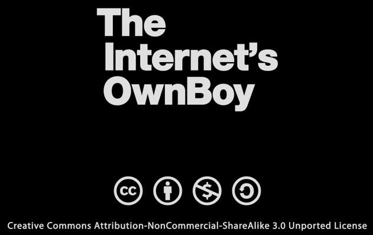

The Internet's Own Boy: The Story of Aaron Swartz
==================================

Fecha: 2014-07-27 03:04
Autor: Osvaldo
Categorías: Aaron Swartz

<!-- break -->

[Aaron Hillel Swartz](http://es.wikipedia.org/wiki/Aaron_Swartz) (8 de noviembre de 1986, Chicago – 11 de enero de 2013, Nueva York) fue un [programador, escritor y activista](http://en.wikipedia.org/wiki/Aaron_Swartz) de Internet. Recibió atención de los medios después de la recolección de artículos de revistas académicas JSTOR.

Fue cofundador de [Reddit](http://www.reddit.com/) y [Demand Progress](http://demandprogress.org/) (conocido por su campaña en contra de [SOPA](https://es.wikipedia.org/wiki/Stop_Online_Piracy_Act)), y previamente cofundó la Progressive Change Campaign Committee. Asimismo fue director técnico de [Open Library](http://openlibrary.org/).

También se centró en la sociología, la conciencia cívica y el activismo. En 2010 fue miembro del Centro de Ética de la Universidad de Harvard. También trabajó con [Rootstrikers](http://www.rootstrikers.org/) grupo activista internacional y de EE.UU. y [Avaaz](http://www.avaaz.org/es/).

En junio de 2013, Swartz fue incluido póstumamente en el [Salón de la Fama de Internet](http://www.internethalloffame.org/press/latest-news/internet-hall-fame-announces-2013-inductees).

Tiempo después, Brian Knappenberger, por medio de [kickstarter](http://www.kickstarter.com/projects/26788492/aaron-swartz-documentary-the-internets-own-boy-0) obtuvo los fondos suficientes (y un poco mas) para filmar el documental [The Internet's Own Boy: The Story of Aaron Swartz](http://vimeo.com/ondemand/internetsownboy/94238859) misma que cuenta con la siguiente licencia:

El documental se puede [alquilar o se puede comprar](http://vimeo.com/ondemand/internetsownboy/94238859), pero también se puede [descargar](http://archive.org/details/TheInternetsOwnBoyTheStoryOfAaronSwartz) y usar los [subtitulos](http://www.amara.org/fr/videos/5Mo4oAj1bxOb/info/the-internets-own-boy-the-story-of-aaron-swartz/) de su agrado.

Espero que se den tiempo para disfrutar de éste documental y lo compartan si les gustó... como yo lo estoy haciendo.

Cierro la presente invitación con las palabras de Tim Berners-Lee:

<pre><code>
Aaron está muerto.
Caminantes del mundo,perdimos a uno de nuestros sabios.
Hackers por derecho,perdimos a uno de los nuestros.
Padres todos,perdimos a un hijo.
Lloremos.
</code></pre>
