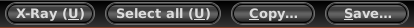

Paginas web grandes en una sola imagen
==================================

Fecha: 2014-08-02 06:39
Autor: Osvaldo
Categorías: GNU/Linux, Firefox, Imagen, Debian

Todos podemos hacer la captura de lo que muestra nuestra pantalla (screenshot) con solo presionar la tecla _ImprPant_ con lo que podemos obtener contenido de la pantalla en formato de imagen. Por lógica, lo mismo podemos hacer para capturar lo que vemos en una pagina web. Ya solo resta hacer las ediciones necesarias (recorte, color, etcétera) a la imagen, si son necesarias.

<!-- break -->

Pero, si el contenido de la pagina web la hace crecer mucho mas allá de la longitud de nuestro monitor, podemos todavía hacer uso de la anterior tecla, aunque para ello tendremos que trabajar un poco más en la edición al unir las varias capturas que hagamos de la pagina web... y que la unión de la parte superior coincida con la inferior y que la unión resultante coincida con la inferior y así sucesivamente.

Para evitar que la unión de las capturas queden mal alineadas podemos practicar bastante hasta tener el pulso necesario... o, usar la extensión abduction! en nuestro [firefox](http://www.mozilla.org/). Con ésta útil extensión instalada podremos obtener una captura en formato de imagen de la pagina que estemos viendo en nuestro firefox.

Instalarla es fácil; solo debemos abrir el administrador de complementos, buscamos <strong>Abduction</strong>; lo buscamos en lo listado por la búsqueda y presionamos el botón Instalar. O podemos ir al sitio web de [Abduction!](http://addons.mozilla.org/es/firefox/addon/abduction/) y presionar el botón _Agregar a Firefox_.

Con lo anterior ya tendremos instalado Abduction! :)

Ahora ya podemos buscar esa enorme pagina web y cuando la encontremos pulsamos el botón derecho de nuestro mouse y del menú elegimos la opción _Save Page As Image..._ con lo que se selecciona, en un color azul en mi caso, un segmento de la pagina web y muestra unos botones:

Las opciones que tenemos ahora son:

* Mover los extremos del área seleccionada (arriba, abajo, izquierda, derecha) hasta tener seleccionado lo que nosotros queremos capturar y presionar el botón Save.
* Usar el botón _X-Ray_ para que, al mover el mouse sobre la pagina web, se seleccioné en color amarillo un elemento programado de la pagina web. Presionamos el botón principal del mouse con lo que cambia el color a el azul seleccionador y presionamos el botón Save para guardar la selección.
* Y la mejor de todas, _Select all_, con lo que seleccionamos toda la pagina web, y presionamos el botón Save para guardar la pagina web completa.

¿Notan la diferencia ;) ?

Espero Abduction! les sea útil como lo es para mi. :)
