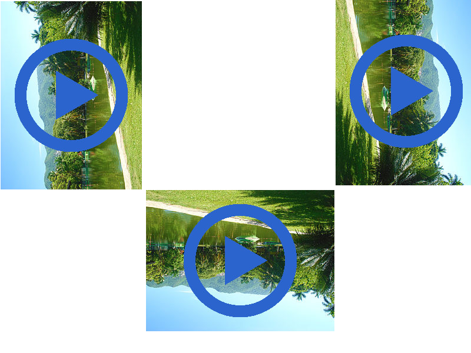

Girar videos en GNU/Linux
==================================

Fecha: 2014-08-10 22:35
Autor: Osvaldo
Categorías: GNU/Linux, Videos, Debian

Se terminaron las vacaciones y ya todos están de regreso para trabajar y/o estudiar. Muchos conservaron de sus vacaciones, si viajaron, recuerdos, fotos y videos; y algunos, por la emoción del momento, lo grabaron con la cámara no de la manera correcta, esto es, inclinada a 90º, 180º o a 270º provocando [tortícolis](http://es.wikipedia.org/wiki/Tort%C3%ADcolis\) a todos los que les presumen los videos.

<!-- break -->

En GNU/Linux podemos girar los videos la cantidad de grados necesarios, para ello podemos usar una de las dos siguientes herramientas: [FFmpeg](http://ffmpeg.org/) o [MEncoder](http://www.mplayerhq.hu/).

Todo lo que mostraré es en [Debian](http://www.debian.org/), por lo que si usas otra distribución, lo instales por favor de acuerdo a ella.

La primer forma de hacerlo es con __FFmpeg__, el cual podemos instalar con:

<pre><code>$ sudo apt-get install ffmpeg
</code></pre>

Una vez instalado, usamos FFmpeg con los siguientes parámetros:

<pre><code>$ ffmpeg -i Video-A-Girar.mp4 -vf "transpose=2" -sameq -y Video-Girado.mp4
</code></pre>

Dependiendo el uso podemos cambiar los valores en _-vf_:

* Para girar 90º en dirección a las agujas del reloj: _\"transpose=2\"_
* Para girar 90º en dirección contraria a las agujas del reloj: _\"transpose=3\"_
* Para girarlo verticalmente: _vflip_

Otra herramienta para girar los videos es __MEncoder__ el cual instalamos con:

<pre><code>$ sudo apt-get install mplayer mencoder
</code></pre>

MEncoder es un codificador de vídeo libre que se incluye en el reproductor multimedia MPlayer, por ello la instalación de ambos.

Una vez instalado, usamos MEncoder con los siguientes parámetros:

<pre><code>$ mencoder -ovc lavc -vf rotate=1 -oac pcm Video-A-Girar.mp4 -o Video-Girado.mp4
</code></pre>

Dependiendo el uso podemos cambiar los valores en _-vf rotate_:

* Para girar 90º en dirección a las agujas del reloj y con flip: _rotate=0_
* Para girar 90º en dirección a las agujas del reloj: _rotate=1_
* Para girar 90º en dirección contraria a las agujas del reloj: _rotate=2_
* Para girar 90º en dirección contraria a las agujas del reloj y con flip: _rotate=3_

Ahora ya pueden disfrutar sus videos sin dañar el cuello.

Recuerden que siempre pueden revisar estos y mas parámetros, tanto de FFmpeg, de MEncoder y de otros comandos, usando el comando _man_:

<pre><code>$ man ffmpeg 
$ man mencoder
</code></pre>

Espero les sea útil.

Nos vemos :D
