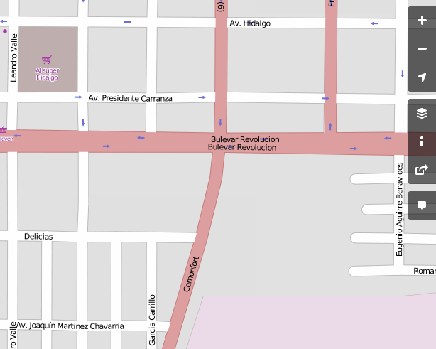

Congreso de Software Libre 2014
==================================

Fecha: 2014-09-13 22:00
Autor: Osvaldo
Categorías: GULAG

Con motivo del **VIII aniversario del Grupo de Usuarios de GNU/Linux de La Laguna (GULAG)**, y con el apoyo de la **Universidad Autónoma de Coahuila, Cordinación Unidad Torreón**, se invita a estudiantes, maestras y maestros, empresarias y empresarios, hackers y público en general al **Congreso de Software Libre** a celebrarse el **19 de septiembre** del presente año, a partir de las **9:00 horas**, en el **Teatro de Cámara** ubicado en el interior del edificio de Coordinación de la **Universidad Autónoma de Coahuila, Unidad Torreón**, ubicado en **Boulevard Revolución y Comonfort**, en Torreón, Coahuila.

<!-- break -->

 <small><a href="http://www.openstreetmap.org/#map=16/25.5352/-103.4467">Ver mapa más grande</a></small>

El púlico asistente al Congreso podrá comprobar las muchas áreas de oportunidades con el Software Libre, mismas que se listan en la siguiente

#### Programación de Conferencias

+ 9:00 AM Bienvenida
+ 9:30 AM **(In)Seguridad en routers/modems de los ISP mexicanos** por Antonio Gurza (Arkebit)
+ 10:15 AM **Equidad de Género en Informática** por Guillermo Valdés Lozano (IMPLAN)
+ 11:00 AM **Software libre en radioastronomía** por José Miguel Jáuregui García (INAOE)
+ 11:45 AM **¿Quién apoya el Software Libre?** por Ernesto Cobos
+ 12:30 PM **Google Cloud Platfform** por Oscar Barajas (DragonsDev)

 
Al término de las conferencias, los asistentes que previamente se registraron, continuaran aprendiendo con los siguientes

#### Talleres

+ **Virtualización para MiPyME** por Gabriel Peña
+ **Envío codificado de mensajes** por Carlos Rojas

_* Los talleres se realizaran con los equipos que lleven los asistentes._

 
La entrada a las conferencias y a los talleres, como siempre en todos los eventos del GULAG, es **sin costo**.

Los esperamos.

**Vive libre, sé libre, usa software libre**

_* Artículo publicado originalmente en el sitio del [GULAG el 13 de septiembre del 2014](http://gulag.org.mx/entradas/2014-09-13-congreso-2014.html)._