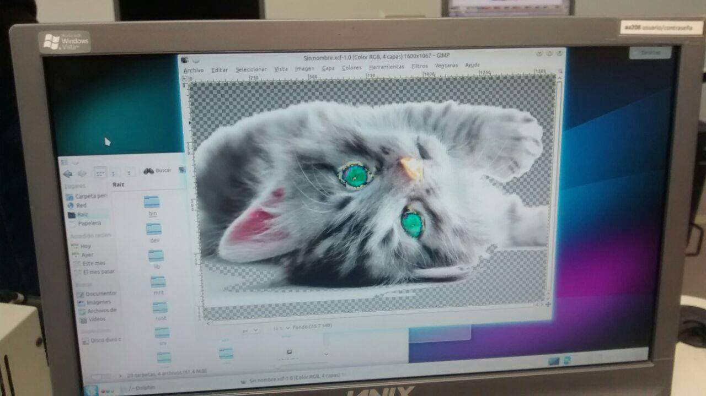
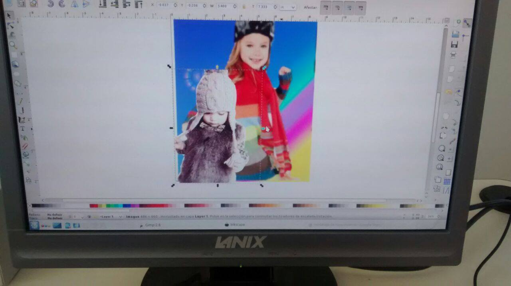

Semana Academica XX.4
==================================

Fecha: 2014-10-16 22:00
Autor: Osvaldo
Categorías: Conferencias, Talleres, Software Libre, Coahuila

Una vez más fui invitado a dar una conferencia y un taller en la Escuela de Sistemas de la [U.A. de C.](http://www.uadec.mx/) Unidad Torreón, todo relacionado con el software libre y siempre representando al [GULAG](http://gulag.org.mx/).

<!-- break -->

### El taller

Primero impartí el taller **"Diseño gráfico con Software Libre"** en donde a los alumnos asistentes les enseñé a usar, de manera básica, tanto [GIMP](http://www.gimp.org/) como [Inkscape](https://www.inkscape.org/) para con ello motivar a ya no usar otros programas de diseño privativos.

Aquí una muestra de la creatividad de las muchachas y los muchachos:

 

### La conferencia

En la conferencia [**"El derecho a la privacidad en la era digital"**](https://github.com/ChicoXXX/Conferencia-DPED) expliqué la historia de la criptografía hasta nuestros dias, declaraciones de distintas personalidades y autoridades con que buscan justificar la vigilancia.

También traté el tema de los derechos humanos que algunos olvidan.

Tocando el tema de software libre señalé su filosofía y algunos programas con los cuales podemos recuperar dicho derecho y con lo que ayuda la campaña [Email Self-Defense](https://emailselfdefense.fsf.org/es/) de la [Free Software Foundation](https://fsf.org/).

De igual manera se citaron ejemplos de invasión a el derecho a la privacidad en algunas partes del mundo.

Aquí el cortometraje "Remove" que también vimos:

<video style="width:400px;height:300px;" controls>
    <source src="2014-10-16-semana-academica-xx-4/Remove.ogv" type="video/ogg">
    
This is fallback content to display if the browser does not support the video element.

</video>
