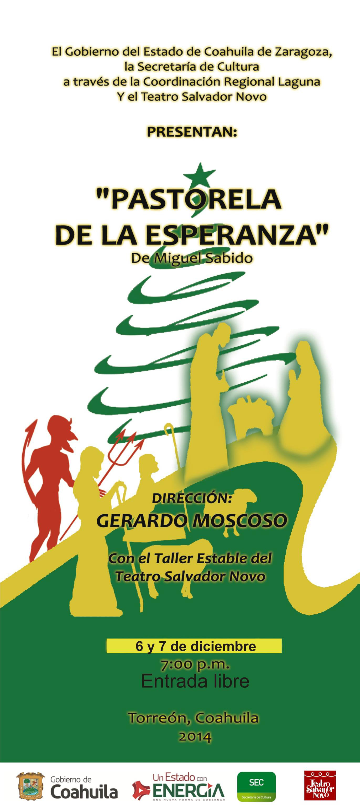

Pastorela de la esperanza - 2014 (II)
==================================

Fecha: 2014-11-28 10:04
Autor: Osvaldo
Categorías: Teatro

Ha llegado diciembre y sus posadas... y tamales, y atole y, por supuesto, sus pastorelas; y en el [Teatro Salvador Novo](http://www.openstreetmap.org/#map=17/25.53003/-103.45253) representaremos para ustedes, sin dilatación ni tardanza una humilde pastorela llamada _"de la esperanza"_.

<!-- break -->

Y por que el público así lo pide, regresamos con la presentación de la obra __"Pastorela de la esperanza"__ de Miguel Sabido, obra que es presentada bajo la dirección de [Gerardo Moscoso C.](http://companialagaviota.com/gerardo-moscoso/), con la brillante participación de 30 actores y actrices de todas las edades, y con un [servidor](https://salazarysanchez.github.io/contacto/contacto.html) como asistente de dirección.

 

Para la temporada noviembre-diciembre del 2014, están invitados a disfrutar del tradicional formato de pastorela, algo surrealista como todas las pastorelas: la travesura de los diablillos, la inocencia de los pastores, un juego de futbol, música, baile y, sin olvidar, la reflexión sobre los problemas actuales.

La obra "Pastorela de la esperanza" se presentará en:

 

#### Torreón, Coahuila; [Teatro Salvador Novo](http://www.openstreetmap.org/#map=17/25.53003/-103.45253); Prol. Calzada Colón y Galeana.

* 29 de noviembre del 2014 a las 19:00 horas.
* 30 de noviembre del 2014 a las 19:00 horas.
* 06 de diciembre del 2014 a las 19:00 horas.
* 07 de diciembre del 2014 a las 19:00 horas.
* 13 de diciembre del 2014 a las 19:00 horas.
* 14 de diciembre del 2014 a las 19:00 horas.

En todas las funciones __la entrada será gratuita__.

 

__Los esperamos :)__

 

__Notas:__

* [Siglo de Torreón - 7 de diciembre del 2014](http://www.elsiglodetorreon.com.mx/noticia/1065298.presentan-pastorela-en-el-novo.html)

 