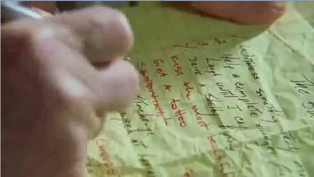

Cosas por hacer
==================================

Fecha: 2014-11-29 23:45
Autor: Osvaldo
Categorías: Cosas por hacer

Hace poco vi nuevamente la película ["The bucket list"](http://www.imdb.com/title/tt0825232/); al terminar la película recordé...

<!-- break -->

...recordé varias personas que por alguna razón no comparten las ideas o proyectos que tienen, ante el temor de la envidia o del mal de ojo o [mencione la superstición que conozca]: "Si digo esto no se va a realizar", "De inmediato empieza la gente mal vibrosa y no se me cumple nada", entre otras expresiones; o en estos tiempos de copyright, "para que no me roben las ideas".

Una frase que repito en mis conferencias es de George Bernard Shaw: "Si tú tienes una manzana y yo tengo una manzana e intercambiamos las manzanas, entonces tanto tú como yo seguiremos teniendo una manzana. Pero si tú tienes una idea y yo tengo una idea e intercambiamos ideas, entonces ambos tendremos dos ideas."

Dicho lo anterior compartiré algunas de las cosas que quiero hacer, o tener. Si quieren ayudar a cumplir uno de estos objetivos (ya sea: que lo hagamos entre los dos, que me ayuden a hacerlo, que me oriente como hacerlo al corto, mediano o largo plazo, o bien, con porras :-) ), de antemano se los agradezco.

* Casarme.
* Viajar a Chiapas.
* Dar, por lo menos, una conferencia sobre [Software Libre](https://es.wikipedia.org/wiki/Software_libre) en cada estado de México.
* Dar, por lo menos, una conferencia sobre Software Libre fuera del país.
* Hacer una Maestría.
* Hacer un Doctorado.
* Poner mi propia empresa.
* Volver a dar clases en una Universidad.
* Realizar investigación científica y/o teatral.
* Tener mi propio observatorio (el cual todos podrán usar sin costo alguno).
* Viajar al espacio.
* Poner una sala de lectura.
* Ser de tal calidad que sea considerado a estar en la Compañía Nacional de Teatro.
* Escribir un libro (Obviamente con licencia [Creative Commons](https://creativecommons.org/)).
* Actuar fuera de mi estado.
* Actuar fuera del país.
* Escalar por lo menos dos montañas.
* Aprender Náhuatl.
* Aprender Zapoteco.
* Montar un mirror de una distribución de GNU/Linux en mi estado.
* Tomar curso con ZK.
* Escribir una obra de teatro.
* Ayudar a que se retire la vigilancia de la Ley de Telecomunicaciones (Artículo 190).

Ésta lista puede crecer el día de mañana, pero trataré que no disminuya.

Si quieren hacer alguno de estos objetivos junto conmigo, son bienvenidas y bienvenidos :-)  :-D

