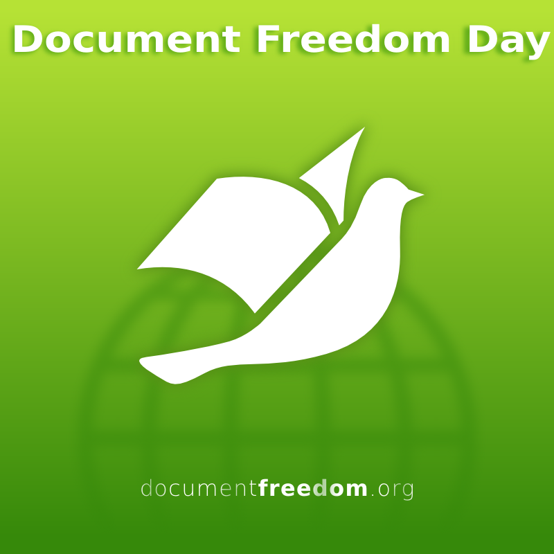
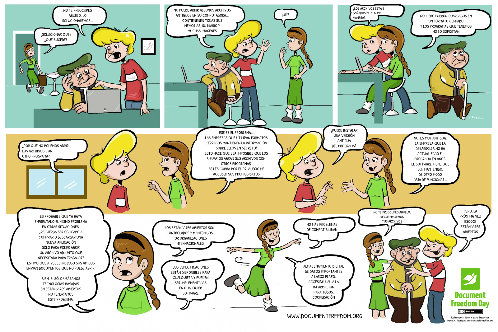
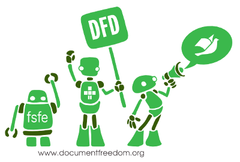

Reseña Document Freedom Day 2015
==================================

Fecha: 2015-03-25 23:00
Autor: Osvaldo
Categorías: Conferencia, Software Libre, Free Software, Document Freedom Day

El 25 de marzo se celebró el __Document Freedom Day__ en Torreón con una conferencia en la Escuela de Sistemas de la U.A. de C.

<!-- break -->

En el marco del [__Día del Documento Libre__](http://documentfreedom.org/index.es.html) di, representando al [GULAG](http://www.gulag.org.mx/) y con la siempre estimulante colaboración de maestros y estudiantes de la Escuela de Sistemas, Unidad Torreón, de la U.A. de C., la conferencia [_"Documentación libre para el software libre"_](http://documentfreedom.org/events/index.es.html).

En dicha conferencia hable de los origenes de OpenOffice y LibreOffice, les explique que es OpenDocument y la norma ISO en la cual se basa.

También les explique la falsedad de "M$ love Linux" y los riesgos que uno tiene al enviar un adjunto en formato privativo, de igual manera los invite a que insistan en el uso de estándares abiertos. Termine la conferencia desarrollando una de las muchas razones por que no me gustan los programas privativos de ofimática.

 
