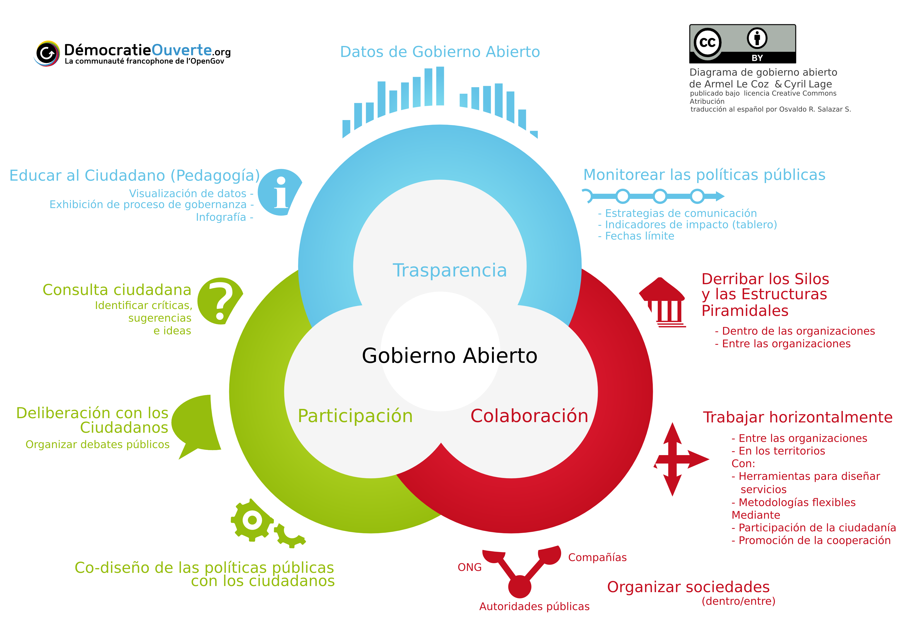

Traducción al español de diagrama (Gobierno Abierto)
==================================

Fecha: 2015-07-11 22:45
Autor: Osvaldo
Categorías: Traducción, Gobierno Abierto, Creative Commons, Inkscape

Existen muchas formas de colaborar en los proyectos de código libre, uno de ellos es traduciendo.

<!-- break -->

Para la traducción al español de el diagrama sobre el tema de [Gobierno Abierto](http://www.trcimplan.gob.mx/blog/la-gran-oportunidad-del-gobierno-abierto.html) use las versiones en inglés e italiano.

También use el archivo fuente ([SVG](https://es.wikipedia.org/wiki/Scalable_Vector_Graphics)) que modifique con [Inkscape](http://inkscape.org/).

 

###Archivo en inglés:

 

###Archivo en italiano:

 

###Archivo fuente (SVG)

 

###Mi traducción al español:

 

Dejo también el link al <a href="2015-07-11-traduccion-infografia-gobierno-abierto/Open_government_-_spanish_1.zip">archivo fuente en español (SVG)</a> en caso de que alguien encuentre un error (el cual espero me lo hagan llegar) o si desean realizar la traducción a otro idioma.

 
