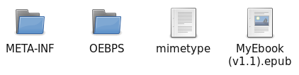
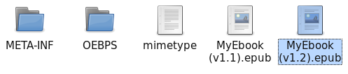

Editar un ePub desde la terminal
==================================

Fecha: 2015-12-26 21:00
Autor: Osvaldo
Categorías: ePub

Después de encontrar un error en un libro en formato ePub, clásico en mí, reporté el error... pero al paso de los días no obtuve respuesta a mi reporte, por lo que decidí corregirlo.

<!-- break -->

Para ello tuve que aprender cómo.

Me recomendaron varios programas, Calibre y Sigil entre ellos, pero fue entonces que me pregunté _"¿Y por qué no modificarlo por terminal?"_. Así que leí la estructura de un archivo ePub.

[ePub](http://idpf.org/epub) (acrónimo de la expresión inglesa Electronic publication - Publicación electrónica) es un formato redimensionable de código abierto para leer textos e imágenes y, desde EPUB3, también permite audio.

En su estructura se marca el contenido, pero no se delimita su formato de pantalla, que se adapta a las dimensiones de las diferentes pantallas de los múltiples dispositivos, como los distintos modelos de lectores de libros electrónicos.

Un fichero EPUB consiste en un archivo comprimido .zip que contiene tres ficheros XML basados en tres estándares abiertos, como son Open Publication Structure (OPS), Open Packaging Format (OPF) y OEBPS Container Format (OCF) [(fuente Wikipedia)](https://es.wikipedia.org/wiki/EPUB).

Partiendo de que es un archivo comprimido, procedemos a usar:

<pre><code>$ unzip MyEbook(v1.1).epub</code></pre>

Con lo anterior obtenemos 

Ahora entramos a el directorio OEBPS y después a Text:

<pre><code>$ cd OEBPS/Text/</code></pre>

Aquí veremos varios .xhtml y buscamos el archivo que tiene la palabra equivocada usando grep:

<pre><code>$ grep -lir "utiizado"</code></pre>

Realizamos la corrección con nuestro editor de texto favorito y, grabamos.

El siguiente paso es, comprimir, __pero con otro nombre__. Para esto usamos:

<pre><code>zip -X MyEbook(v1.2).epub mimetype</code></pre>

Estamos a punto de terminar; solamente nos resta usar los siguientes comandos:

<pre><code>zip -rg MyEbook(v1.2).epub META-INF -x \*.DS_Store</code></pre>

y

<pre><code>zip -rg MyEbook(v1.2).epub OEBPS -x \*.DS_Store</code></pre>

¡Listo! Ahora podemos leer la nueva versión de nuestro ePub en nuestro dispositivo preferido (previa sincronización) y con nuestro lector favorito, en mi caso es [Cool Reader](https://f-droid.org/repository/browse/?fdfilter=coolreader&fdid=org.coolreader).

 
