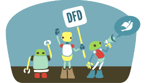
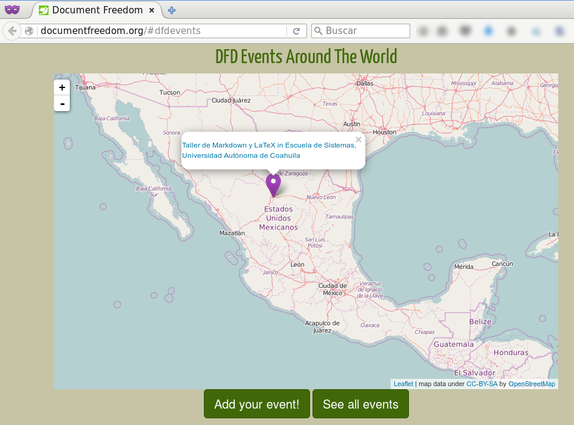

Document Freedom Day 2016 en Torreón
==================================

Fecha: 2016-03-14 23:00
Autor: Osvaldo
Categorías: Conferencias, Taller, Software Libre, Free Software, Document Freedom Day

El próximo __16 de marzo__ se celebrará el __Document Freedom Day__ en Torreón con un taller en la Escuela de Sistemas de la UAdeC.

<!-- break -->

 

El [__Día del Documento Libre__](http://documentfreedom.org/index.es.html) se celebra el 30 de marzo en varias partes del mundo, pero dado el calendario escolar en México se celebrará el 16 de marzo en la Escuela de Sistemas de la UAdeC, con el [_"Taller de Markdown y LaTeX"_](http://documentfreedom.org/events/index.es.html), un taller donde los alumnos, maestros y el público asistente podrá generar distintos tipos de documentos (.pdf, .tex, por ejemplo) a partir de un sencillo archivo markdown (.md) así como aprender las nociones de LaTeX.

 

 

La Escuela de Sistemas de la Universidad Autónoma de Coahuila está ubicada en las instalaciones de la Ciudad Universitaria en la Carretera Torreón-Matamoros. _La cita es el 16 de marzo a las __12:00 horas__._

<a href="http://www.openstreetmap.org/#map=16/25.5288/-103.3335">
 <small><a href="http://www.openstreetmap.org/#map=16/25.5288/-103.3335">Ver mapa más grande</a></small>
</a>
 

 
