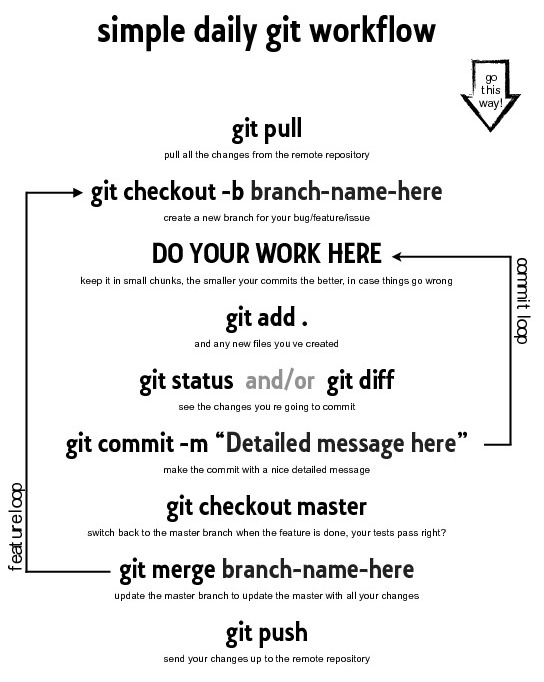

Taller de git y github en la Escuela de Sistemas U.T. de la UAdeC
==================================

Fecha: 2017-03-08 22:00
Autor: Osvaldo
Categorías: Conferencias, Software Libre

Atendiendo a la invitación, acudí el 7 de marzo a dar el taller **"Compartiendo código con Git y Github"** en la Semana Académica celebrada por la **[Escuela de Sistemas, Unidad Torreón](http://www.sistemastorreon.uadec.mx/sistemas/) de la [Univeridad Autónoma de Coahuila](http://www.uadec.mx/)**, como siempre representando al [GULAG](http://gulag.org.mx/).

<!-- break -->

 

En dicho taller creamos una cuenta en [Github](https://github.com/) y creamos un repositorio en el cual trabajamos después de conocer los comandos básicos de [Git](https://git-scm.com/) y se les recordó un diagrama como el [siguiente](https://www.sonassi.com/blog/knowledge-base/our-magento-git-guide-and-work-flow):

