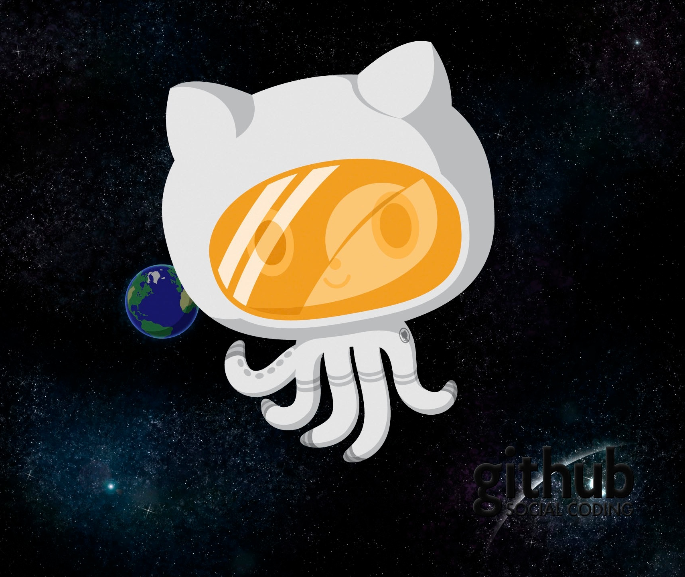

[Software+Hardware] Libre + Astronomía
==================================

Fecha: 2017-10-09 23:40
Autor: Osvaldo
Categorías: Conferencias, GULAG, Astronomía

Con motivo de la celebración de la [Semana Mundial del Espacio](http://aem.gob.mx/sme-mexico/2017/) y con el [Grupo Astronómico de Gómez Palacio](https://facebook.com/pages/Grupo-Astron%C3%B3mico-G%C3%B3mez-Palacio/114277575272066/) como sede en Gómez Palacio, Dgo., impartí, representando al [GULAG](http://www.gulag.org.mx/), la conferencia _"[Software+Hardware] Libre + Astronomía"_ en el CONALEP de Gómez Palacio.

 

<!-- break -->

 

Se mostraron las virtudes del Software Libre y se explicaron las 4 libertades que se tienen.

Se enseñaron distintos programas, tanto para PC como para smartphone, que se usan en astronomía así como el código fuente de los mismos. Entre el código que vieron está el que llevó al Apolo 11 a La Luna.

También se listó hardware y software especializado para radioastronomía y procesamiento de imágenes.

La presentación se puede ver en [Github](https://github.com/ChicoXXX/Conferencia--Sw-Hw-Free-Astro).
