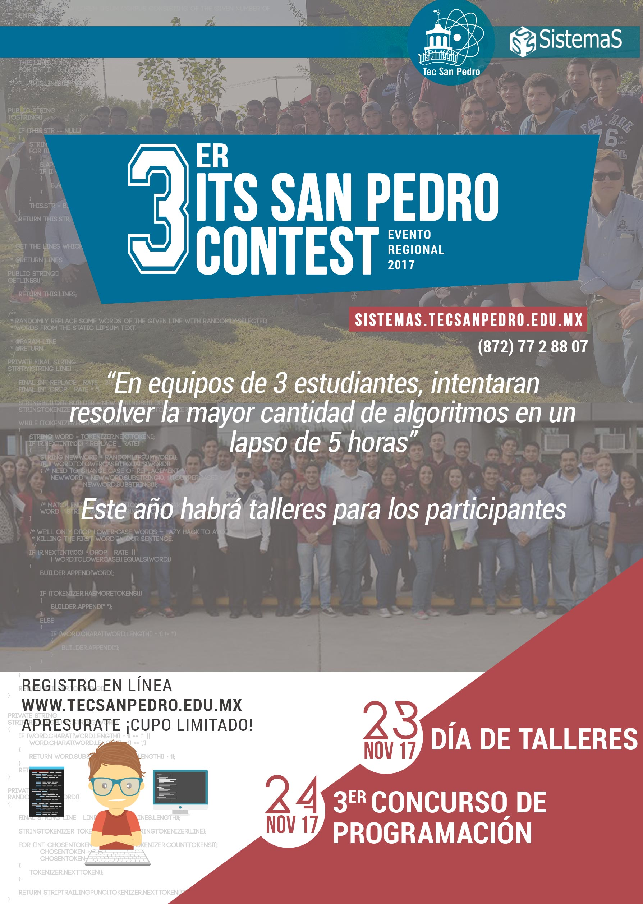

Tercer ITS San Pedro Contest
==================================

Fecha: 2017-11-01 15:00
Autor: Osvaldo
Categorías: Concurso de Programación

Comparto con todos la **Convocatoria** que hace el **[Instituto Tecnológico Superior de San Pedro de Las Colonias](http://www.tecsanpedro.edu.mx/web/)** para participar en el **3er. Concurso de Programación IT San Pedro Contest** a realizarse el **23 y 24 de Noviembre del 2017**, con el objetivo de fomentar la programación de alto nivel entre estudiantes de nivel superior.

<!-- break -->

 

 

#### Lugar:

Se llevará a cabo en las instalaciones del [Instituto Tecnológico Superior de San Pedro de las Colonias](http://www.tecsanpedro.edu.mx/web/), Calzada del Tecnológico N.o 53, Col. El Tecnológico, San Pedro, Coahuila 23 y 24 de Noviembre del 2017, 8:30 horas.

 

#### Ambiente de desarrollo:

* Lenguajes: C, C++, Java.
* IDE: Netbeans.
* Sistema Operativo: Ubuntu

 

#### Participantes:

Podrá registrarse cualquier estudiante de educación superior que pueda comprobar su escolaridad. La competencia será por equipos de tres personas y un coach.

 

#### Registro:

Los aspirantes deberán realizar su registro antes del 17 de noviembre en:
[https://www.eventbrite.es/e/entradas-its-san-pedro-contest-39622629351](https://www.eventbrite.es/e/entradas-its-san-pedro-contest-39622629351)

 

#### Competencia:

El concurso será desarrollado en conjunto con el proyecto URI JUDGE ONLINE de Brasil quien proporcionará su plataforma para el desarrollo de la competencia, igualmente los problemas serán manejados por ellos para evitar preferencias entre las universidades participantes. 

Los problemas serán presentados en inglés. 

Se permite ingresar libros en formato físico, no son será permitido ningún medio electrónico.

 

#### Premiación:

Se premiarán a los integrantes del primer lugar. Además de diploma de participación a los equipos del concurso.

 

#### Problemas de Práctica:

* [https://uva.onlinejudge.org/](https://uva.onlinejudge.org/)
* [https://www.urionlinejudge.com.br/](https://www.urionlinejudge.com.br/)

 

#### Contacto y Mayores Informes:

Instituto Tecnológico Superior de San Pedro de las Colonias Tel. (872)772 88 07 Ext. 123 itsspcontest@tecsanpedro.edu.mx

 

### Descargas

* [Flyer](2017-11-10-3er-ITS-San-Pedro-Contest/contents2017_flyer.jpg)
* [Convocatoria](2017-11-10-3er-ITS-San-Pedro-Contest/ITScontest_Convocatoria_2017.pdf)

