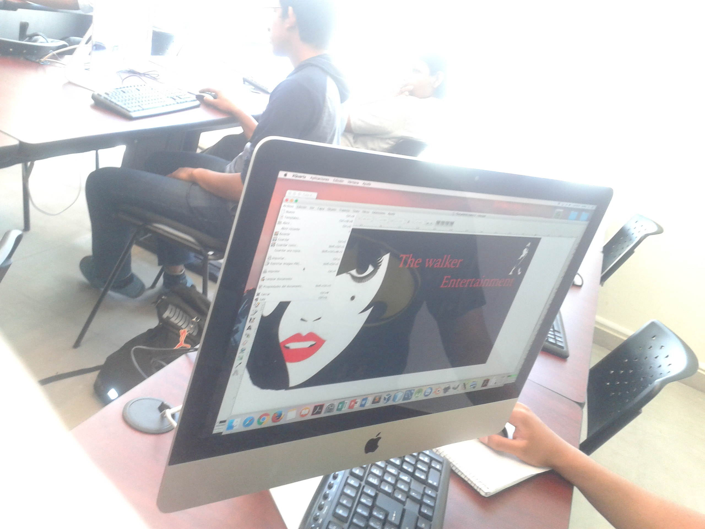

Semana Académica en Escuela de Sistemas U.T. - UAdeC
==================================

Fecha: 2018-03-15 22:00
Autor: Osvaldo
Categorías: Conferencias, Talleres, Software Libre, Free Software, Coahuila, Diseño Gráfico, Inkscape, Gimp

Atendiendo a la invitación, acudí a dar un taller y una conferencia en la XXVIII Semana Académica celebrada por la [Escuela de Sistemas, Unidad Torreón](http://www.sistemastorreon.uadec.mx/sistemas/) de la [Univeridad Autónoma de Coahuila](http://www.uadec.mx/), como siempre representando al [GULAG](http://gulag.org.mx/).

<!-- break -->

 

### El taller

El 12 de marzo impartí el taller **"Diseño gráfico con Software Libre"** en donde a los alumnos asistentes les enseñé a usar, tanto [GIMP](http://www.gimp.org/) como [Inkscape](https://www.inkscape.org/), para crear su publicidad y con ello motivar a ya no usar otros programas de diseño privativos.

 

 

 

 

### La conferencia

Dentro del mismo evento, pero el 15 de marzo, impartí la conferencia [**"Industria 4.0"**](https://github.com/ChicoXXX/Conferencia-4i) donde expliqué la historia que llevó a dicha industria así como las tecnologías que la conforman y como la suma de ellas, junto con el uso de Software Libre, puede dar, en el futuro, mejoras tanto laborales como de vida.

 

 

