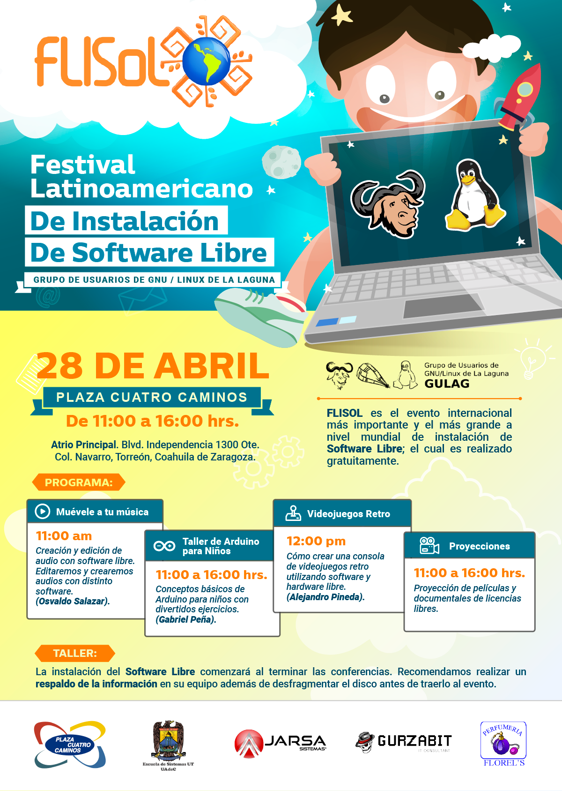

FLISOL 2018
===========

Fecha: 2018-04-28 10:00
Autor: Osvaldo
Categorías: Install Fest, FLISOL, GULAG, Conferencias, Música, Coahuila

 

Con el objetivo de promover y difundir el uso de Software Libre, el próximo **sábado 28 de abril de 2018** se llevará a cabo el **[Festival Latinoamericano de Instalación de Software Libre](https://flisol.info/FLISOL2018/Mexico/Torreon)** en el atrio principal de la **Plaza Cuatro Caminos** ubicado en Blvd. Independencia 1300 Ote. Col.Navarro en **Torreón, Coahuila, México.**

<!-- break -->

 

 

El Festival Latinoamericano de Instalación de Software Libre (FLISOL) **es el evento internacional más importante y el más grande a nivel mundial de instalación de Software Libre;** el cual es realizado gratuitamente, a los asistentes que participen llevando su equipo de cómputo, **se les instala software libre** en los mismos. El evento FLISOL lo ha venido realizando GULAG desde el año de 2006 ininterrumpidamente con el apoyo de diversos patrocinadores. El festival ha tomado tanta relevancia a nivel internacional que en ciudades de países NO latinoamericanos como Portugal, Estados Unidos y Canadá se han unido a su realización.

#### Distribuciones ofrecidas:

+ Debian (recomendado)
+ Guadalinex
+ Manjaro
+ Mint
+ Trisquel
+ Ubuntu
+ Opensuse

#### Fecha, lugar y hora

+ Fecha: **Sábado 28 de abril de 2018.**
+ Lugar: **Plaza Cuatro Caminos**, Atrio principal. Blvd. Independencia #1300 Ote, Col. Navarro Torreón, Coahuila, México.
+ Horario: **De las 11:00 hasta las 16:00 horas.**

#### Mapa

<iframe width="425" height="350" frameborder="0" scrolling="no" marginheight="0" marginwidth="0" src="https://www.openstreetmap.org/export/embed.html?bbox=-103.43679428100586%2C25.558185387938092%2C-103.43080759048462%2C25.561001942070654&amp;layer=mapnik" style="border: 1px solid black"></iframe> <small><a href="https://www.openstreetmap.org/#map=18/25.55959/-103.43380">View Larger Map</a></small>

#### Actividades

+ Charlas
+ Muestra de Software Libre
+ Festival de instalación
+ Contacto con la comunidad de Software Libre local.

#### ATENCIÓN

Se recomienda que antes de asistir al evento haga un **RESPALDO DE LA INFORMACIÓN IMPORTANTE y desfragmentar el disco duro.**

#### Programa

+ 11:00 Bienvenida
+ 11:15 **Muévele a tu música** por **Osvaldo Salazar**
+ 12:00 **Videojuegos Retro** por Alejandro Pineda
+ 11:00 **Taller de Arduino para niños** por Gabriel Peña
+ 11:00 **Proyección de películas y documentales con licencias libres**
+ 13:00 **Inicio del Festival de Instalación**

Evento dirigido a todo tipo de público: estudiantes, académicos, empresarios, trabajadores, funcionarios públicos, entusiastas y aun personas que no poseen mucho conocimiento informático.

### Descargas

* [Poster Flisol 2018 - Baja Resolución](2018-04-28-flisol/Flisol-2018-LowRes.png)
* [Poster Flisol 2018 - Alta Resolución](2018-04-28-flisol/Flisol-2018-HiRes.jpg)
