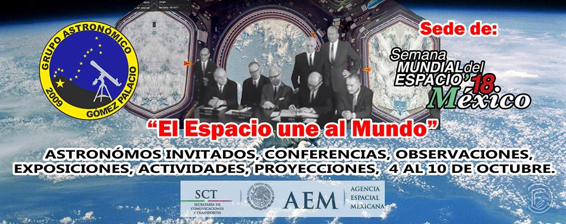
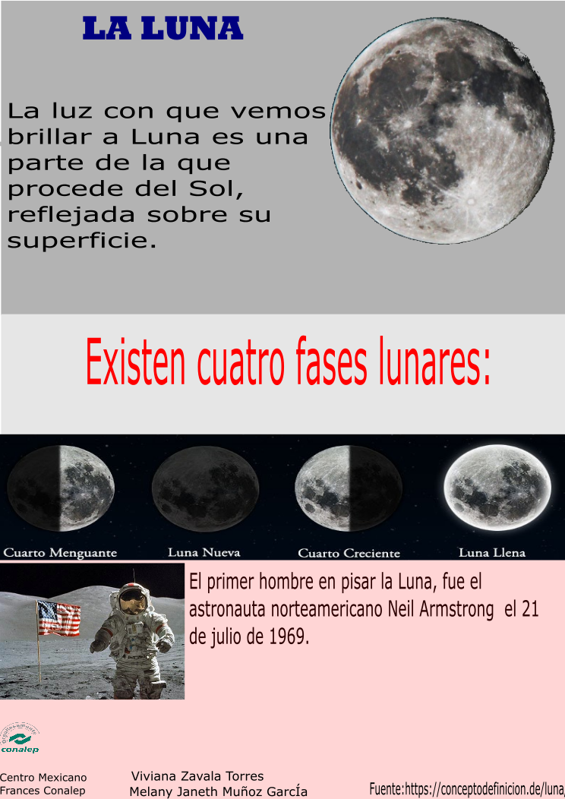
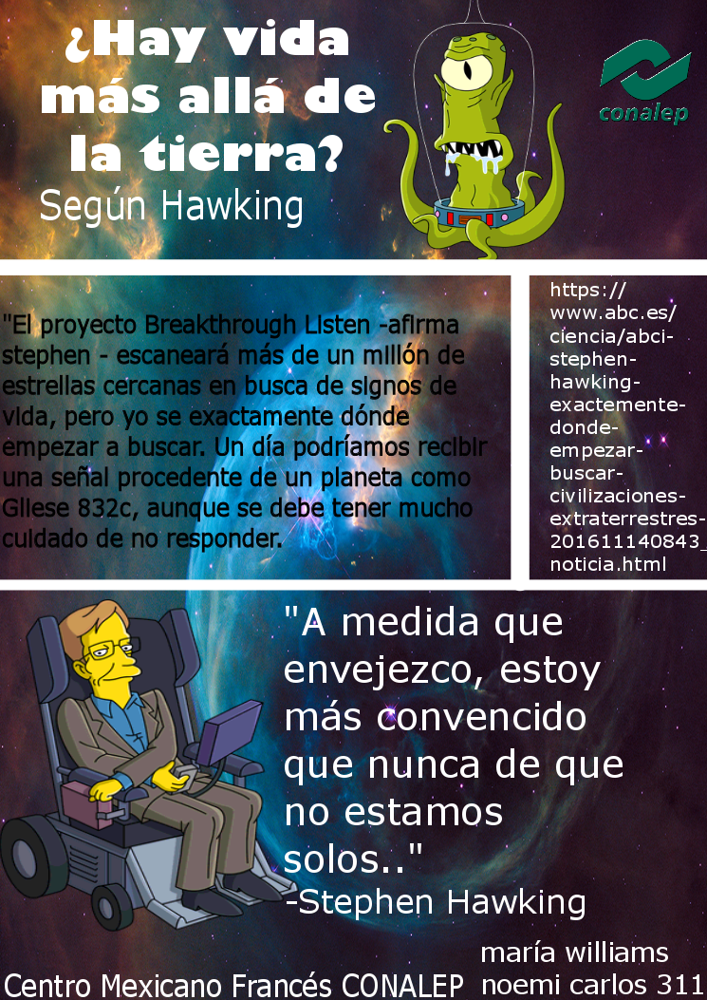
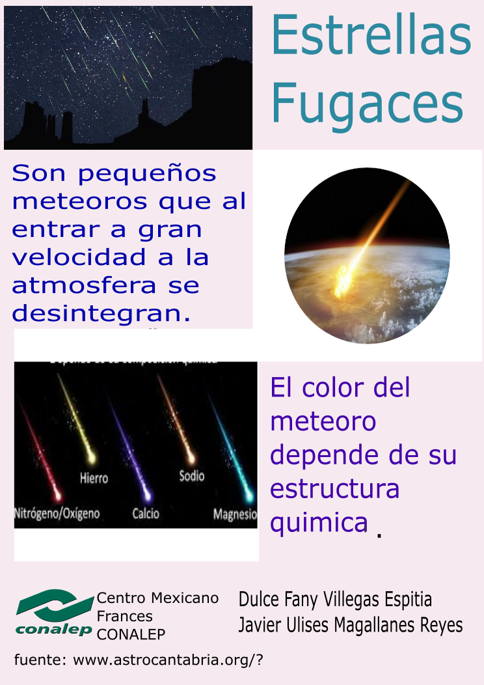
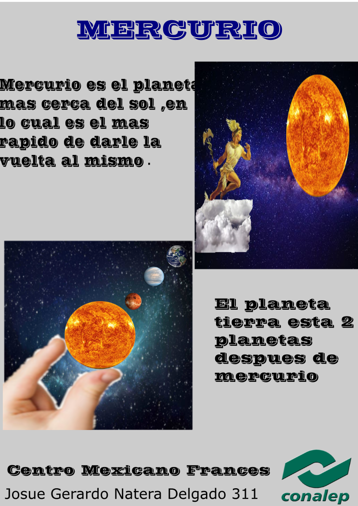

Taller Infografía Espacial con Software Libre
==================================

Fecha: 2018-10-05 13:00
Autor: Osvaldo
Categorías: Talleres, GULAG, Astronomía, Semana Mundial del Espacio, Durango, Diseño Gráfico, Inkscape, Gimp

Con motivo de la celebración de la [Semana Mundial del Espacio](https://haciaelespacio.aem.gob.mx/sme-mexico/2018/) y con el [Grupo Astronómico de Gómez Palacio](https://facebook.com/pages/Grupo-Astron%C3%B3mico-G%C3%B3mez-Palacio/114277575272066/) como sede en Gómez Palacio, Dgo., impartí, representando al [GULAG](http://www.gulag.org.mx/), el taller _"Infografía Espacial con Software Libre"_ en el Centro Mexicano-Francés del Conalep de Gómez Palacio.

 

<!-- break -->

<i>Crédito de imagen: Cesár Fabian, miembro del <a href="https://facebook.com/pages/Grupo-Astron%C3%B3mico-G%C3%B3mez-Palacio/114277575272066/">Grupo Astronómico de Gómez Palacio</a></i>

 

Se mostraron las virtudes del Software Libre y se explicaron las 4 libertades que se tienen.

El siguiente paso fue indicar como hacer una infografía, las partes que la conforman. Para este taller se usaron los programas [GIMP](https://www.gimp.org/) e [Inkscape](https://inkscape.org/) de los cuales se dieron las instrucciones básicas para realizar sus trabajos de una manera muy práctica, sin costo y con un toque más profesional.

A continuación se muestran algunos trabajos que los alumnos realizaron:

 

 

 

 

La presentación se puede ver en [Github](https://github.com/ChicoXXX/Taller-Infografia-Espacial-con-Software-Libre).
