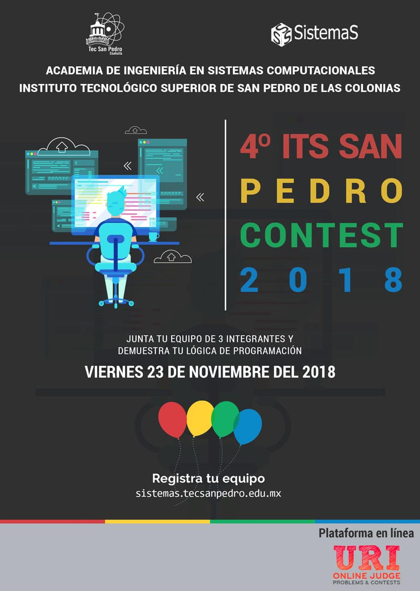

4o Concurso de Programación DEL ITS San Pedro Contest
==================================

Fecha: 2018-10-27 1:00
Autor: Osvaldo
Categorías: Concurso de Programación, Coahuila

Comparto con todos la **Convocatoria** que hace el **[Instituto Tecnológico Superior de San Pedro de Las Colonias](http://www.tecsanpedro.edu.mx/web/)** para participar en el **4o Concurso de Programación IT San Pedro Contest** a realizarse el **23 de Noviembre del 2018**, con el objetivo de fomentar la programación de alto nivel entre estudiantes de nivel superior.

<!-- break -->

 

 

#### Lugar:

Se llevará a cabo en las instalaciones del [Instituto Tecnológico Superior de San Pedro de las Colonias](http://www.tecsanpedro.edu.mx/web/), Calzada del Tecnológico N.o 53, Col. El Tecnológico, San Pedro de las Colonias, Coahuila 23 de Noviembre del 2018, 8:30 horas.

 

#### Ambiente de desarrollo:

* Lenguajes: C, C++, Java.
* IDE: Netbeans.
* Sistema Operativo: Windows

 

#### Participantes:

Podrá registrarse cualquier estudiante de educación superior que pueda comprobar su escolaridad. La competencia será por equipos de tres personas y un coach.

 

#### Registro:

Los equipos deberán registrarse en la página de internet [http://sistemas.tecsanpedro.edu.mx](http://sistemas.tecsanpedro.edu.mx) antes del 16 de noviembre. Los equipos estarán conformados por 3 integrantes y 1 coach. Los integrantes no podrán participar en más de 1 equipo y 1 coach puede tener varios equipos. _*Limitado a Confirmación_

 

#### Competencia:

El concurso será desarrollado en conjunto con el proyecto URI JUDGE ONLINE de Brasil quien nos proporcionará su plataforma para el desarrollo de la competencia, igualmente los problemas serán manejados por ellos para evitar preferencias entre las universidades participantes. Los problemas serán presentados en inglés. Los equipos podrán traer solo libros de programación y algoritmos para consulta.

 

#### Premiación:

Se premiarán a los integrantes del primer lugar. Además de diploma de participación a los participantes del concurso.

 

#### Problemas de Práctica:

* [https://uva.onlinejudge.org/](https://uva.onlinejudge.org/)
* [http://www.spoj.com/](http://www.spoj.com/)
* [http://hs.spoj.pl/](http://hs.spoj.pl/)
* [https://www.urionlinejudge.com.br/](https://www.urionlinejudge.com.br/)

 

#### Contacto y Mayores Informes:

Jefe de División de Ingeniería en Sistemas Computacionales. Ing. Jose Luis Mota Espeleta. div.sistemas@tecsanpedro.edu.mx

Presidente de Academia. MSC. Ulises Martínez Rodríguez umr@tecsanpedro.edu.mx

 

### Descargas

* [Flyer](2018-10-27-ITS-San-Pedro-Contest-2018/contents2018_flyer.jpg)
* [Convocatoria](2018-10-27-ITS-San-Pedro-Contest-2018/IT San Pedro Contest 2018.pdf)
