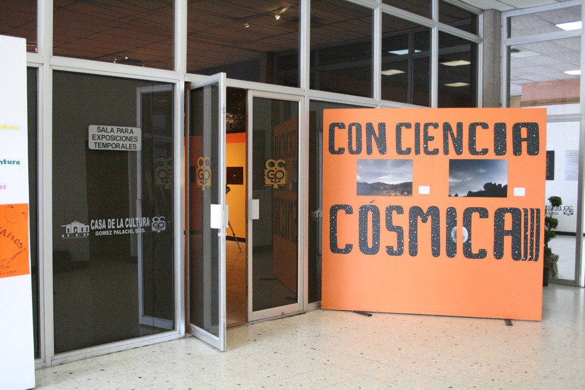

¡Feliz X aniversario Grupo Astronómico Gómez Palacio!
==================================

Fecha: 2019-01-08 13:00
Autor: Osvaldo
Categorías: Astronomía, Durango

 

¡Diez años! Parece que fue ayer cuando iniciamos la primer reunión.

<!-- break -->

A continuación leerán la semblanza preparada por Dioselina Zatarain, Jorge Machuca y Cesár Fabian, miembros del __[Grupo Astronómico Gómez Palacio](https://www.facebook.com/Grupo-Astron%C3%B3mico-G%C3%B3mez-Palacio-114277575272066/)__ : 

En __Enero de 2009__ por acuerdo de un grupo de entusiastas aficionados a la Astronomía deciden formalizar e iniciar el Grupo Astronómico Gómez Palacio, aún sin sede oficial y reuniéndose en la casa particular de uno de los integrantes en la calle Ramón Corona de la ciudad de Torreón, Coahuila.

Tomando la decisión de buscar un lugar adecuado para realizar las reuniones semanales, y así poder hacer la invitación extensiva a la sociedad Gómez palatina, para lo cual se tenían contemplados varios sitios, entre ellos la __Casa de la Cultura de Gómez Palacio__, en donde finalmente nos abrieron sus puertas para realizar nuestras actividades, como hasta hoy en día.

Durante estos primeros 10 años, hemos logrado acercar la ciencia a la juventud y niñez lagunera, con eventos que van desde las instalaciones de nuestra sede, la Casa de la Cultura de Gómez Palacio, hasta las aulas de diferentes instituciones, con conferencias brindadas por excelentes divulgadores hasta científicos de renombre.

 

 

Uno de nuestros primeros proyectos de gran éxito fue __"Conciencia Cósmica"__ en el año de 2011 desarrollado en nuestra sede y en donde recibimos la visita de varios planteles educativos desde nivel primaria hasta bachillerato, con un aproximado de asistencia de 2,000 alumnos en 2 semanas de duración, el cual fue tomado en cuenta por la cámara de diputados como uno de los 3 mejores proyectos a nivel nacional.

Se han recibido invitaciones a campamentos por parte de la Secretaía de Cultura del Estado de Coahuila, para apoyar con pláticas y observaciones en áreas rurales, en los cuales se ha notado el gran interés de los participantes que van desde los niños pequeños hasta personas de la tercera edad con las charlas sobre Constelaciones, Sistema Solar hasta las observaciones con los telescopios.

 

 

Eventualmente se realizan diversos talleres entre ellos __Astrofotografía__, para lo cual se convoca los integrantes de nuestro grupo y fotógrafos en general para practicar estas técnicas de fotografía de larga exposición, y trasladándonos a el cielo oscuro de la __Zona del Silencio__.

Durante los dos últimos años se ha participado en coordinación con la __Agencia Espacial Mexicana__, dentro de la celebración de la __"Semana Mundial del Espacio"__, que organiza la O.N.U. a nivel internacional, en donde brindamos apoyo a planteles educativos en la organización de la misma, realizando conferencias, proyecciones, talleres, exposiciones y observaciones con el público en general.

Esto es solo una muestra de algunas de nuestras actividades realizadas en esta primera década, esperando seguir con el mismo entusiasmo como hasta hoy!

En el [Grupo Astronómico Gómez Palacio](https://www.facebook.com/Grupo-Astron%C3%B3mico-G%C3%B3mez-Palacio-114277575272066/), sesionamos __todos los Martes de 20:30 a 21:30 horas__ en las instalaciones de la __Casa de la Cultura de Gómez Palacio__, quién guste integrarse es bienvenido, la __"Entrada es libre"__.

 

