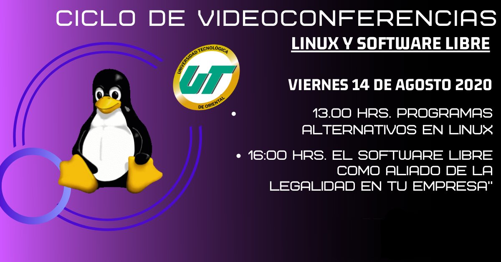

Videoconferencia: El Software Libre como aliado de la legalidad en tu empresa
===========

Fecha: 2020-08-14 16:00
Autor: Osvaldo
Categorías: Conferencias, Software Libre, Free Software, Puebla

El 14 de agosto impartí la videoconferencia **El Software Libre como aliado de la legalidad en tu empresa** en la Universidad Tecnológica de Oriental en Puebla.

<!-- break -->

Durante el desarrollo de la misma se les explicó distinto Software Libre para cada área y etapa de su futura empresa; desde paquete ofimático hasta herramientas de una empresa de sistemas.

También se les mostró casos reales realizados por un servidor.

### Descargas

* [Enlace a Github](https://github.com/ChicoXXX/Conferencia-Software-Libre-Aliado-Legalidad)

