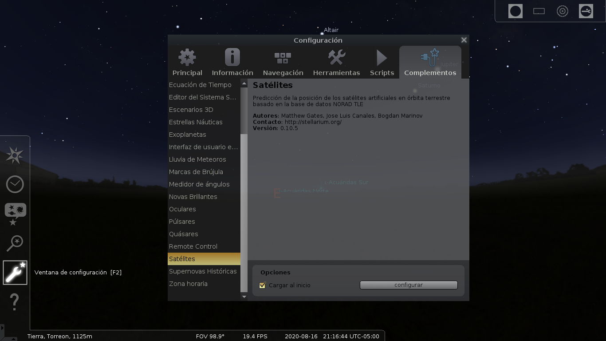
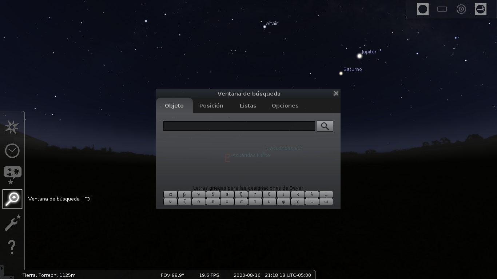
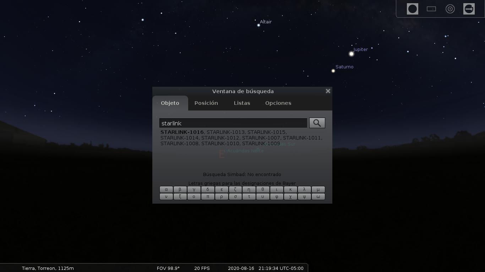
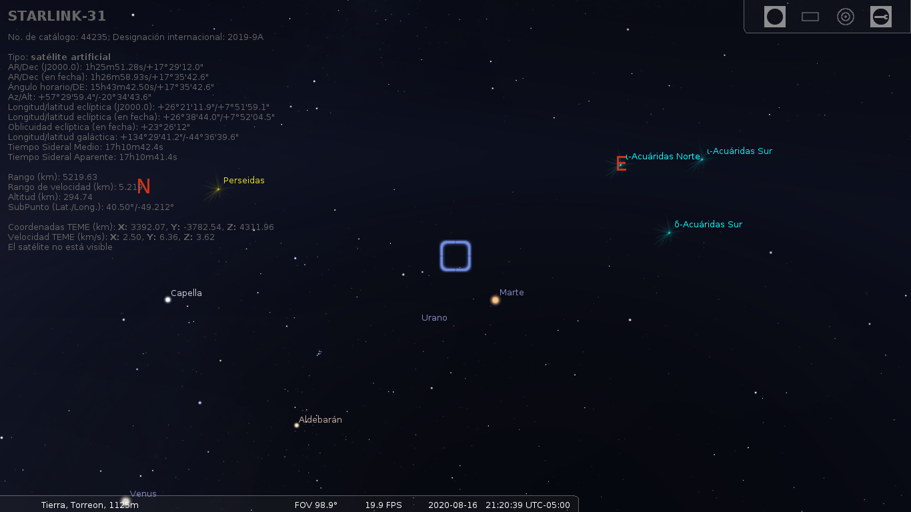

Starlink en Stellarium
==================================

Fecha: 2020-08-16 16:30
Autor: Osvaldo
Categorías: Astronomía

<!-- break -->

 

[Stellarium](https://stellarium.org/) es un programa que permite simular un planetario en nuestra computadora; es Software Libre y está disponible para los principales sistemas operativos, entre ellos Linux, Windows y Mac OS. Todas las versiones usan OpenGL para representar una proyección realista del cielo nocturno en tiempo real.

Permite calcular la posición del Sol, la Luna, planetas, constelaciones y estrellas, además simula el cielo dependiendo de la localización y tiempo del observador. También simula fenómenos astronómicos, tales como lluvias de meteoros y eclipses lunares y solares.

También podemos observar con él el paso de satélites. Para observar los satélites [Starlink](https://es.wikipedia.org/wiki/Starlink), de la empresa SpaceX, se tiene que configurar Stellarium de la siguiente manera.

Primero habilitamos **ver los satélites** ya sea presionando **Ctrl+z** o dando click en el icono que muestra la siguiente imagen.

 

En seguida vamos a el menú de **configuración (F2)** en donde nos mostrará una ventana de **Configuración**, abrimos la opción de **complementos** y buscamos la opción de **satélites**. Ahora presionamos el botón **configurar**.

 

Ahora veremos la ventana **Configuración de Satélites** en la cual abrimos la pestaña **Fuentes**; en el cuadro de texto que está en la parte inferior escribiremos **[http://celestrak.com/NORAD/elements/starlink.txt](http://celestrak.com/NORAD/elements/starlink.txt)**. Presionamos el **botón +**.

 

Ahora vamos a la pestaña **Configuración** donde presionaremos el botón **Actualizar**.

 

Una vez terminada la actalización cerramos las ventanas activas y abrimos la **ventana de búsqueda** o presionamos la tecla **F3**.

 

Aquí escribimos **starlink-** y veremos una lista de dichos satélites.

 

Elegimos un número de los mostrados o alguno que deseemos, en mi ejemplo usé el **starlink-31**.

 

¡Listo!

Podemos hacer zoom in (**Re Pag**) o zoom out (**Av Pag**) y saber en qué momento podremos observalo en el cielo.

