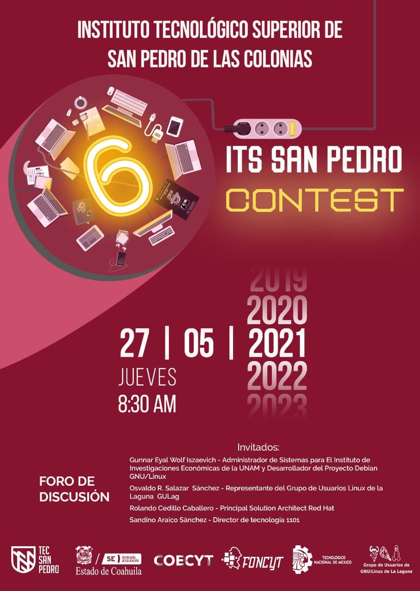

6o Concurso de Programación DEL ITS San Pedro Contest
==================================

Fecha: 2021-05-27 1:00
Autor: Osvaldo
Categorías: Foro, Concurso de Programación, Coahuila

El **[Instituto Tecnológico Superior de San Pedro de Las Colonias](http://www.tecsanpedro.edu.mx/web/)** me invitó a participar en un foro de discusión en el marco del **6o Concurso de Programación IT San Pedro Contest** realizado el **27 de mayo del 2021** al que acudí representando al [Grupo de Usuarios de GNU/Linux de La Laguna](http://www.gulag.org.mx).

<!-- break -->

 

