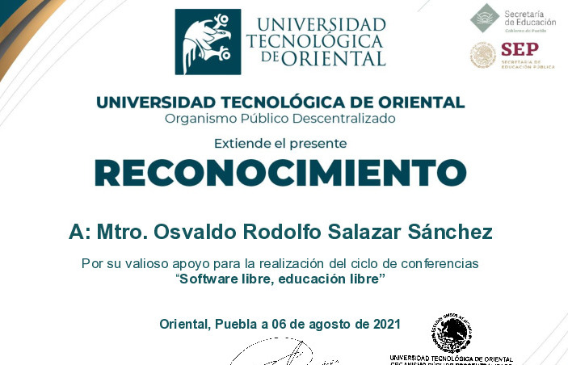

Videoconferencia: Software Libre, Educación Libre
===========

Fecha: 2021-08-06 16:00
Autor: Osvaldo
Categorías: Conferencias, Software Libre, Free Software, Puebla

El 6 de agosto impartí la videoconferencia **Software Libre, Educación Libre** en la Universidad Tecnológica de Oriental en Puebla.

<!-- break -->

Durante el desarrollo de la misma se les explicó la relación entre el Software Libre y la educación; también se explicó el por qué las instituciones educativas deben utilizar y enseñar software libre.

También se les platicó casos reales realizados por un servidor.

### Descargas

* [Enlace a Github](https://github.com/ChicoXXX/Conferencia-Software-Llibre-Educacion-Libre)
* [Enlace a GitLab](https://gitlab.com/ChicoXXX/software-libre-educacion-libre)
