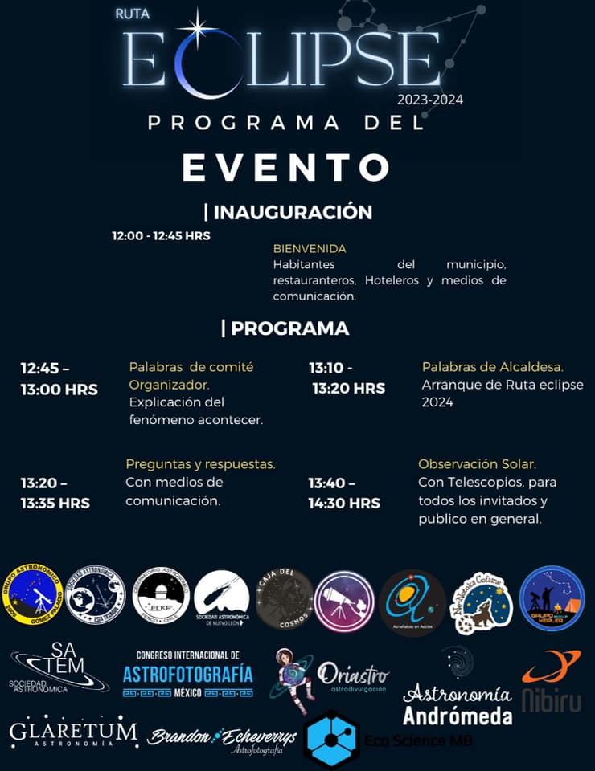

Presentación de la Ruta eclipse 2023-2024
===========

Fecha: 2021-11-06 10:00
Autor: Osvaldo
Categorías: Astronomía, Durango, Eclipse 2024, Eclipse 2023

El próximo 8 de noviembre del 2021, desde el Pueblo Mágico de Mapimí, en Durango, México, se presentará la **[Ruta Eclipse 2023–2024](https://www.instagram.com/rutaeclipsemx)**.

 

 

<!-- break -->

Recordemos que durante el eclipse solar del año 2017 diversas autoridades e instituciones educativas prohibian salir a ver el eclipse.

Para evitar esto y además iniciar una campaña de promoción y educación para estos próximos eventos astronómicos Tania Arguijo, Presidenta de la Sociedad Astronómica de Nuevo León, explicará la importancia que tienen los futuros eclipses en México.

En México tendremos dos eclipses próximamente: 

* Eclipse Anular de Sol el **14 de octubre 2023**
* Eclipse Total de Sol el **8 de Abril del 2024**

El segundo eclipse va ser el más llamativo, el más vistoso, el más visitado. Es el clásico eclipse donde se va a oscurecer todo y va a ser algo que no se va a repetir... al menos no de manera inmediata.

En la Ruta Eclipse 2023–2024 se tendrá la participación de varias asociaciones y grupos, entre ellos el [Grupo Astronómico Gómez Palacio](https://www.facebook.com/Grupo-Astron%C3%B3mico-G%C3%B3mez-Palacio-114277575272066).

 

 

El programa de la presentación de la Ruta Eclipse 2023–2024 es la siguiente:

 

 

#### Los esperamos :-)

 

#### Notas de prensa

* [ABC Noticias](https://abcnoticias.mx/local/2021/10/29/presentara-sociedad-astronomica-de-nuevo-leon-ruta-eclipse-2023-2024-149909.html)
* [Milenio](https://www.milenio.com/estados/coahuila-mapimi-vera-eclipse-sol-en-2024-)
