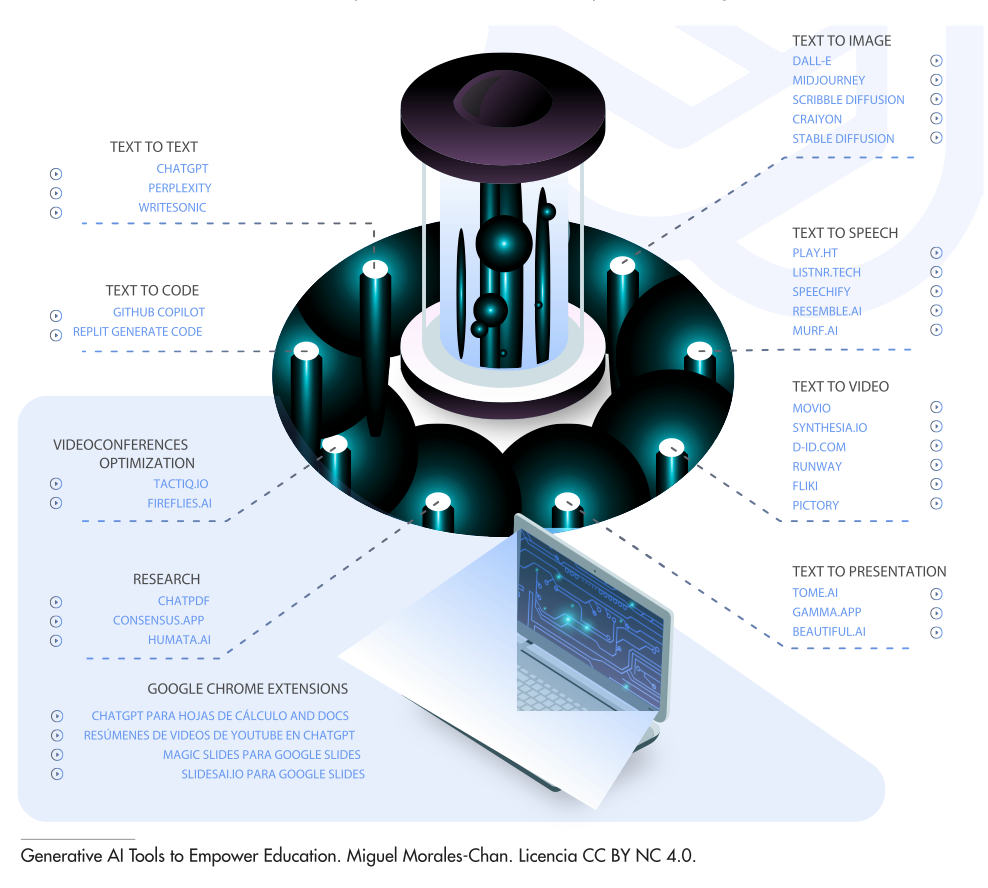

Bits Libres - Inteligencia Artificial en el aula
==================================

Fecha: 2023-10-01 8:00
Autor: Osvaldo
Categorías: Publicaciones, Bits Libres

_Publicado en la sección [Bits Libres](http://www.gulag.org.mx/sobre-la-seccion-bits-libres.html) del periódico [Entretodos](http://periodicoentretodos.mx/version-impresa/), en octubre del 2023_

<!-- break -->

### Inteligencia Artificial en el aula

"La inteligencia artificial (IA) tiene la oportunidad de hacer frente a uno de los mayores desafíos que afronta hoy en día el ámbito de la educación y es el de desarrollar prácticas de enseñanza y aprendizaje innovadoras así como acelerar el progreso en la consecución del [ODS 4](https://www.un.org/sustainabledevelopment/es/education/)", esto es, Educación de Calidad. 

Lo anterior lo menciona la UNESCO en su documento "[Artificial intelligence in education](https://www.unesco.org/en/digital-education/artificial-intelligence)" en donde invita a garantizar que la utilización de las tecnologías de la IA en el contexto educativo esté regida por los principios fundamentales de inclusión y equidad.

No obstante, estos rápidos avances tecnológicos implican inevitablemente numerosos riesgos y retos, que los debates sobre las políticas y los marcos reglamentarios tienen aún dificultades para poder superarlos; y para esto la UNESCO propone soluciones en su documento "[AI and education: guidance for policy-makers](https://unesdoc.unesco.org/ark:/48223/pf0000376709)".

A esto se suman las "[Recomendaciones para la docencia con inteligencias artificiales generativas](https://e-archivo.uc3m.es/bitstream/handle/10016/37989/recomendaciones_inteligencias_artificiales_uc3m_2023.pdf)" de la Universidad Carlos III de Madrid que ve como una gran oportunidad el uso de de la IA para "diseñar un plan de estudios, pensar una metodología docente disruptiva, estructurar una clase, realizar un trabajo solicitado, preparar un examen, crear un vídeo, o estudiar con espíritu crítico y constructivo".

El profesor–investigador Gabriel Pérez Salazar de la Universidad Autónoma de Coahuila, explica en "[Uso del ChatGPT y otros LLMs en los entornos educativos](https://gabrielperezsalazar.files.wordpress.com/2023/08/perez-salazar-uso-del-chatgpt-y-otros-llms-en-los-entornos-educativos.pdf)" como "comprender y utilizar los diversos patrones empleados por los LLM [...] con énfasis en usos educativos (tanto para maestros como para estudiantes)". Recomiendo usar la [declaratoria informativa](https://www.unotv.com/estados/coahuila/profesor-crea-declaratoria-informativa-para-que-sus-alumnos-digan-si-una-ia-hizo-su-tarea/) de uso de IA para sus estudiantes que él creó.

