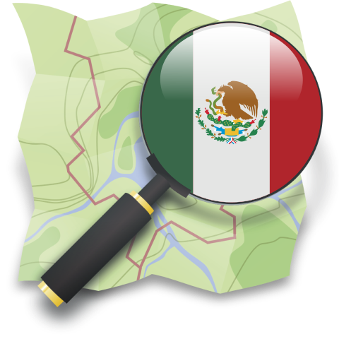

Listado de sitios con OSM en México
==================================

Fecha: 2023-12-25 11:00
Autor: Osvaldo
Categorías: OpenStreetMap, OSM

[OpenStreetMap (OSM)](https://www.openstreetmap.org/) es un proyecto colaborativo para crear mapas editables y libres.

 

 

<!-- break -->

Los mapas se crean utilizando [información geográfica](https://es.wikipedia.org/wiki/Informaci%C3%B3n_geogr%C3%A1fica) capturada con dispositivos GPS móviles, [ortofotografías](https://es.wikipedia.org/wiki/Ortofotograf%C3%ADa) y otras fuentes libres. Esta cartografía, tanto las imágenes creadas como los datos vectoriales almacenados en su base de datos, se distribuye bajo licencia abierta [Licencia Abierta de Bases de Datos](https://es.wikipedia.org/wiki/Licencia_Abierta_de_Bases_de_Datos) (en inglés ODbL).

Si alguien necesita mostrar algo en un mapa puede usar OpenStreetMap para ello. Varias empresas, instituciones y aplicaciones lo usan ya sea para uso particular, institucional o gubernamental.

Existen [listados](https://wiki.openstreetmap.org/wiki/ES:LatAm/P%C3%A1ginas_web_y_aplicaciones) donde se muestra que países y organizaciones lo usan.

En el caso de México se tiene un listado de ello [aquí](https://wiki.openstreetmap.org/wiki/ES:M%C3%A9xico/P%C3%A1ginas_web_y_aplicaciones_que_usan_los_mapas_de_OpenStreetMap):

 

 

Si usas OpenStreetMap en:

* tu empresa
* tu escuela
* tu proyecto

no dudes en agregarlo a esta lista.

 

Con toda confianza puedes enviarme ya sea por [X/Twitter](https://twitter.com/osvaldo_salazar), [mastodon](https://mastodon.social/@chicoxxx) o [telegram](https://t.me/joinchat/AhKXM0m4OTrdeN2x2yz1VQ) el link del sitio donde se muestre que se está usando OpenStreetMap y con gusto lo subiré.

