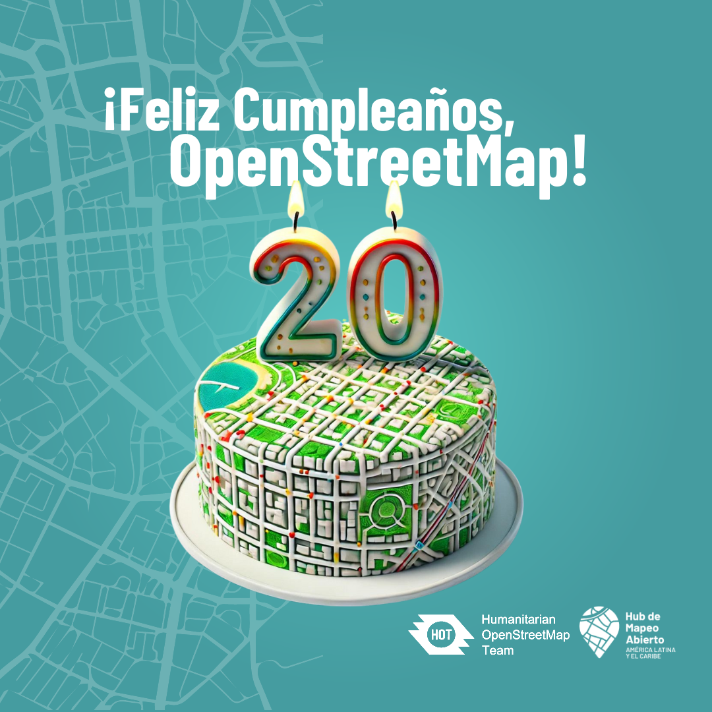

20 años de OpenStreetMap
==================================

Fecha: 2024-08-09 09:00
Autor: Osvaldo
Categorías: OSM, OpenStreetMap

¡Este año [OpenStreetMap](https://es.wikipedia.org/wiki/OpenStreetMap) cumple 20 años! :-D

<!-- break -->

 

 

No tengo presente en que momento empecé a escuchar de él, pero si recuerdo que me [registré](https://www.openstreetmap.org/user/ChicoXXX) en su plataforma en el 2013. De ahí en delante fueron ediciones esporádicas, hasta que un año después de iniciada la pandemia de covid-19 lo retomé de manera más constante. Desde febrero del 2023 estoy colaborando con el [Humanitarian OpenStreetMap Team](https://tasks.hotosm.org/users/ChicoXXX)

De ahí a la fecha fui conociendo y aprendiendo de las y los grandes en OSM... y sigo aprendiendo de ellas y de ellos.

En este año ayudé a formar un grupo de YouthMappers en la UJED de Gómez Palacio: [FICA Mappers](https://wiki.openstreetmap.org/wiki/FICA_Mappers), con ellos me [reuní](https://www.instagram.com/p/C-d-mIJSTZH/) para celebrar este aniverario.

Para celebrar este aniversario de OSM [la Comunidad OpenStreetMap de Colombia](https://linktr.ee/osm_colombia) realizó una [serie de entrevistas](https://www.youtube.com/watch?v=Kp3sWxrCPs8&list=PLI7a5sSUigMSKO5gNIeKhfA4whLtTMyrK&ab_channel=ComunidadOpenStreetMapColombia) y fui seleccionado para ser entrevistado. Aquí la entrevista:

<iframe width="560" height="315" src="https://www.youtube.com/embed/c69kDwE_Ig4?si=PxWLEovjul66pan5" title="YouTube video player" frameborder="0" allow="accelerometer; autoplay; clipboard-write; encrypted-media; gyroscope; picture-in-picture; web-share" referrerpolicy="strict-origin-when-cross-origin" allowfullscreen></iframe>

Si te interesa aprender a mapear con esta maravillosa herramienta, estoy con la disposición de enseñar :-D

