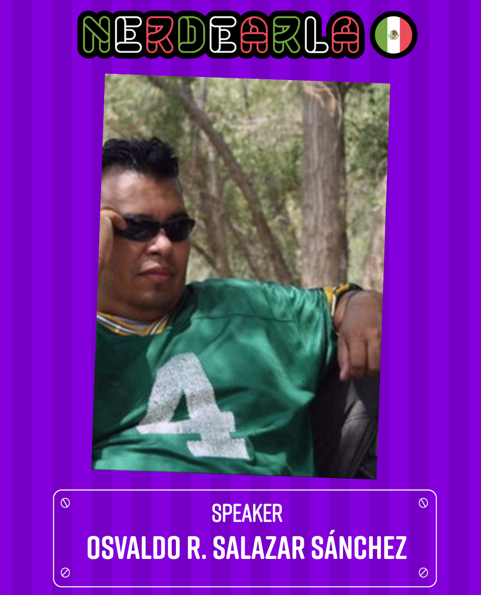

Nerdearla México 2024
==================================

Fecha: 2024-11-09 16:00
Autor: Osvaldo
Categorías: Talleres, Nerdearla, GULAG, Astronomía, CDMX, Blender, Python

¡Logro desbloqueado!

El 9 de noviembre participé en [Nerdearla](https://nerdear.la/es/) en su edición para [México 2024](https://nerdearla.mx/es/)

<!-- break -->

 

[Nerdearla](https://nerdear.la/es/) busca promocionar el intercambio de conocimiento en el ecosistema de ciencia y tecnología, creando un espacio de encuentro con contenido de alto nivel y 100% dedicado a profesionales de sistemas y a nerds de la ciencia... y todo gratis :-D

Como siempre, representando al [Grupo de Usuarios de GNU/Linux de La Laguna](http://www.gulag.org.mx/) y al [Grupo Astronómico de Gómez Palacio](https://linktr.ee/grupoastronomicogp), [participé](https://nerdearla.mx/es/speakers/osvaldo-r-salazar-sanchez/) con el [taller](https://nerdearla.mx/es/agenda/programando-una-orbita-planetaria-con-blender-y-python/) _"Programando una órbita planetaria con [Blender](http://www.blender.org) y [Python](https://www.python.org)"_ donde mostré como podemos crear un par de objetos y hacerlos orbitar.

Si no estuvieron en vivo durante su emisión, pueden verla aquí:

<iframe width="560" height="315" src="https://www.youtube.com/embed/me9F2QWFm1g?si=Fz8tyPKeYu5iX2zd" title="YouTube video player" frameborder="0" allow="accelerometer; autoplay; clipboard-write; encrypted-media; gyroscope; picture-in-picture; web-share" referrerpolicy="strict-origin-when-cross-origin" allowfullscreen></iframe>
 

La presentación y el código lo pueden encontrar [aquí](https://github.com/ChicoXXX/OrbitaPlanetas-NerdearlaMX2024).

