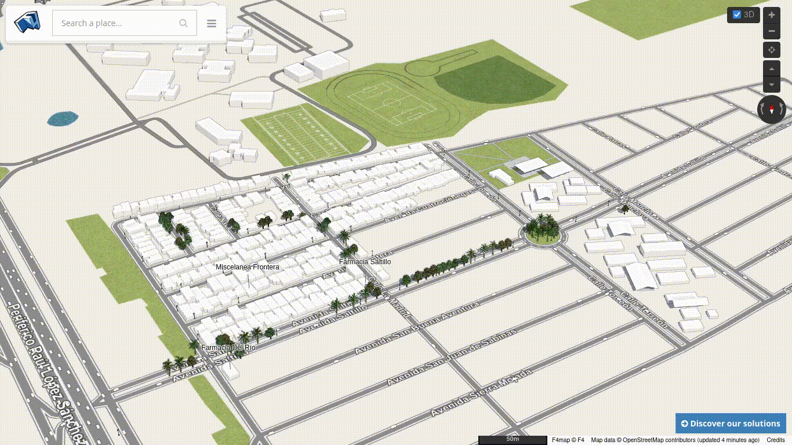

Crear gif a partir de un video con ffmpeg
==================================

Fecha: 2025-02-01 11:30
Autor: Osvaldo
Categorías: ffmpeg, OSM, OpenStreetMap

He contiuado editando en [OpenStreetMap (OSM)](https://www.openstreetmap.org/) y quise crear un video con lo que agregué en este mes, pero después decidí hacerlo en gif.

<!-- break -->

Para ello entre a ver la versión en 3D en [f4map](https://demo.f4map.com/) del área que quiero mostrar. Después usé [SimpleScreenRecorder](https://www.maartenbaert.be/simplescreenrecorder/) para grabar unos segundos del área. Como también me grabó audio usé el siguiente comando en la terminal para extraer solo el video:

<pre><code>ffmpeg -i Mapeo-Enero-2025-2025-01-31_12.08.19.mkv -an -c:v copy Mapeo-Enero-2025.mp4</code></pre>

Una vez obtenido solamente el video lo último fue usar el siguiente comando para obtener el archivo gif.

<pre><code>ffmpeg -i Mapeo-Enero-2025.mp4 Mapeo-Enero-2025.gif</code></pre>

Y así es como obtuve el siguiente gif:

 

 

Al verlo terminado vi que... pude haberlo hecho solo con el segundo comando... ya que no pasa el audio al gif...

jejeje ¡ups! XD

