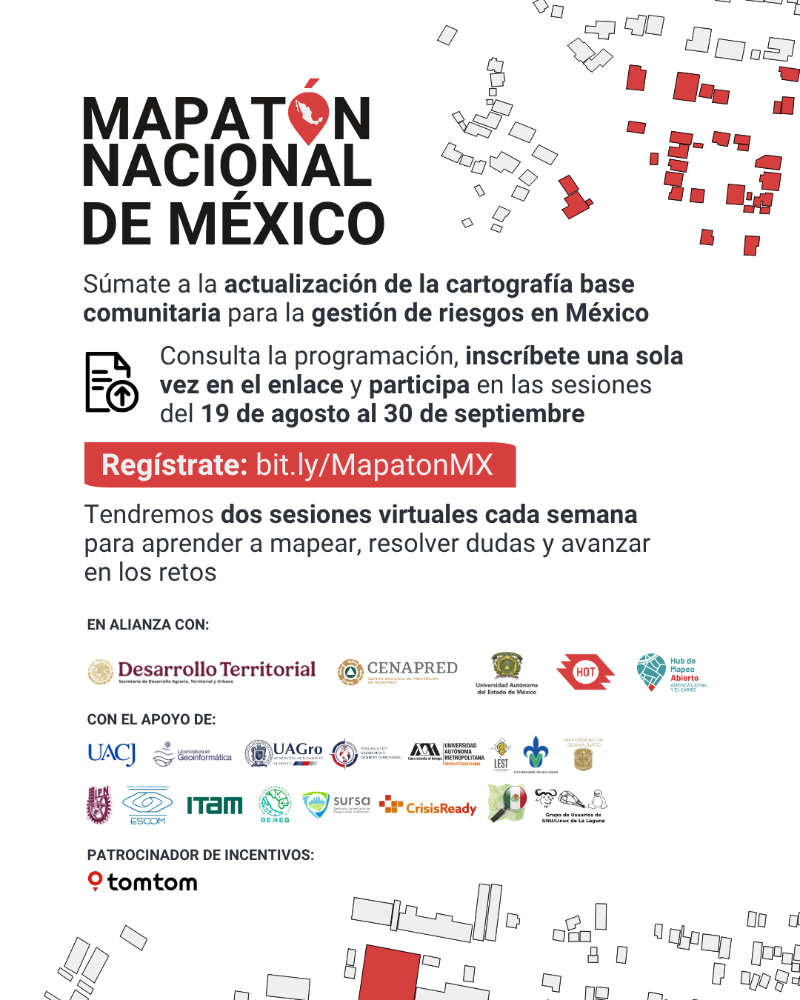

Mapatón Nacional de México 2025
==================================

Fecha: 2025-08-19 08:00
Autor: Osvaldo
Categorías: OpenStreetMap, OSM, Mapatón

¡El Mapatón Nacional de México 2025 está por arrancar! Este es un ejemplo de cómo la movilización digital de cientos de personas mapeadoras puede cerrar vacíos de datos críticos en los territorios más vulnerables del país.

<!-- break -->

 

 

La [Ciencia Ciudadana](https://es.wikipedia.org/wiki/Ciencia_ciudadana) puede transformar la forma en que enfrentamos la crisis climática en México cerrando la brecha de datos cartográficos a nivel nacional.

 
🌎 A través del mapeo abierto, buscamos:

✔️ Generar información clave para la toma de decisiones

✔️ Fortalecer redes colaborativas de impacto territorial

 

🗺️ [Mapearemos 20 municipios](https://tasks.hotosm.org/explore?campaign=2025+M%C3%A9xico+Mapat%C3%B3n+Nacional&omitMapResults=1) con alta exposición climática, gracias al trabajo voluntario de una comunidad decidida a actuar.

💻 ¡Únete! No necesitas experiencia o conocimiento previo. Durante las sesiones te enseñaremos paso a paso, el equipo resolverá dudas y encontrarás una comunidad de mapeo que te acompañará durante el proceso.

 
🗓 Martes y jueves | 17:00 a 19:00 h

📅 19 de agosto – 30 de septiembre

✍️ Regístrate aquí: [bit.ly/MapatonMX](bit.ly/MapatonMX)

 

Convocan: [LAC Hub](https://linktr.ee/maphublac/), [Humanitarian OpenStreetMap Team](https://www.hotosm.org/), [Secretaría de Desarrollo Agrario, Territorial y Urbano](https://www.instagram.com/sedatu_mx/), [Universidad Autónoma del Estado de México](https://www.uaemex.mx/), [Grupo de Usuarios de GNU/Linux de La Laguna](http://www.gulag.org.mx/mapaton-nacional-de-mexico-2025.html) y CENAPRED.

