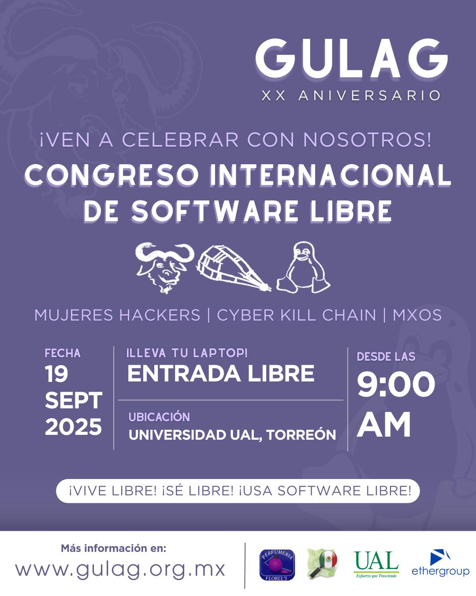

Congreso de Software Libre 2025
==================================

Fecha: 2025-09-12 08:00
Autor: Osvaldo
Categorías: OpenStreetMap, OSM, Software Libre, Free Software, Talleres, Coahuila

Hemos llegado a este momento especial y me gustaría todos fueran parte de él: el XX aniversario del [Grupo de Usuarios de GNU/Linux de La Laguna](http://www.gulag.org.mx/).

<!-- break -->

 

 

Lo celebraremos en la __Universidad Autónoma de La Laguna__ el __19 de septiembre__ desde las __9:00 horas__ con conferencias y talleres.

Toda la información la encontrarás en el sitio web del GULag [http://www.gulag.org.mx/proximamente-congreso-2025.html](http://www.gulag.org.mx/proximamente-congreso-2025.html)

 

 

__"Mujeres Hackers"__ es el tema principal, pero también tendremos temas en el área de seguridad, nuevos sistemas, apoyo para las juventudes emprendedoras con su contabilidad, contratos inteligentes, inteligencia artificial y más sorpresas que se están preparando.

### Taller de mapeo

Yo estaré dando un taller de [Mapeo con OpenStreetMap](https://osmcal.org/event/4030/), mismo que buscará, además de enseñar los conceptos básicos de mapeo, el integrar a las personas asistentes al Mapatón Nacional de México 2025 cuya celebración está en curso.

Espero que todas las personas que conozcan y les interese el Software Libre nos puedan acompañar el __19 de septiembre__ desde las __9:00 horas__.

Recuerden: 😃🐧 ¡La entrada es Libre! 😃🐧

