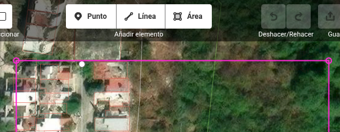
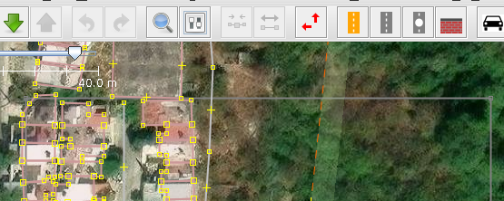
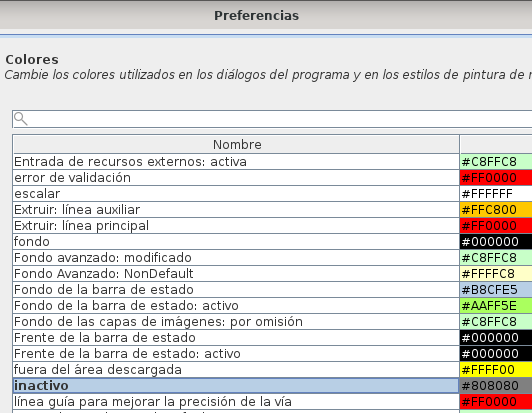
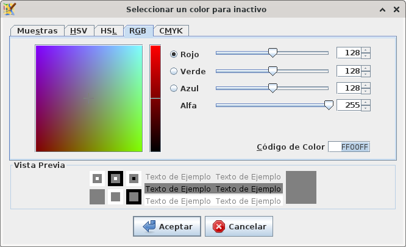
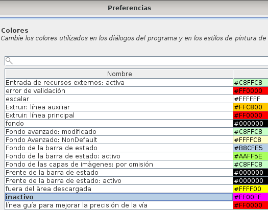
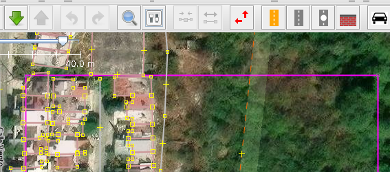

Resaltar área de trabajo en JOSM
==================================

Fecha: 2025-09-14 23:30
Autor: Osvaldo
Categorías: OpenStreetMap, OSM, JOSM

ID Editor fue como muchos empezamos a editar en [OpenStreetMap](https://www.openstreetmap.org/); después al subir el nivel empezamos a usar [JOSM](https://josm.openstreetmap.de/), con las ventajas que vienen con él.

<!-- break -->

 

 

Pero una cosa que extrañaba de ID Editor era que mi área de trabajo en JOSM estuviera delimitada con ese cuadro de color magenta. Estuve buscando en mis ratos libres hasta que encontré como cambiarlo.

 

 

En JOSM entramos a __Preferencias__ (que se puede activar con la tecla __F12__) y en el apartado de __Colores__ buscamos la opción que tiene por nombre __inactivo__. Damos doble-click en él.

 

 

Nos abrirá un cuadro de diálogo para cambiar el color; iremos a la pestaña __RGB__ donde cambiaremos el __Código de color__ por el que deseemos, para mi nostalgia, __FF00FF__. Damos click en el botón _Aceptar_.

 

 

Nos regresará a la ventana de preferencias donde veremos el cambio de color. Presionamos el botón de _Aceptar_.

 

 

¡Y listo!

 

 

Ya veremos nuestra área de trabajo en JOSM con el color elegido 🗺😃

