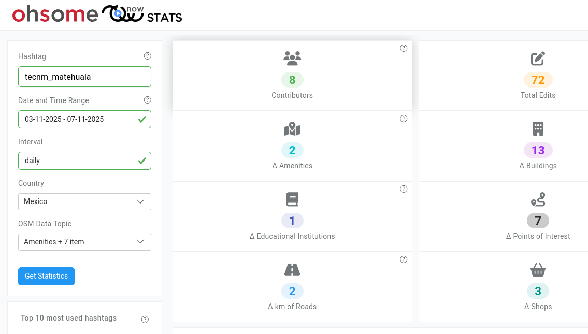
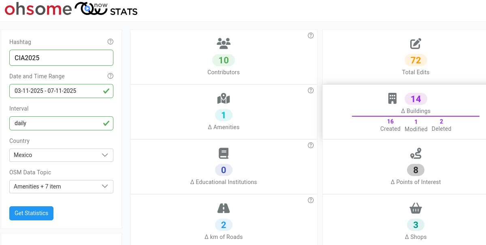

Congreso Internacional Académico 2025
==================================

Fecha: 2025-11-05 08:00
Autor: Osvaldo
Categorías: Conferencias, Talleres, OSM, OpenStreetMap, San Luis Potosí, Ciencia Ciudadana, Free Software, GNU/Linux, Software Libre

El 5 de noviembre del 2025 participé en el Congreso Internacional Académico 2025 organizado por el __Tecnológico Nacional de México Campus [Instituto Tecnológico de Matehuala](https://matehuala.tecnm.mx/)__, en Matehuala, San Luis Potosí, con un taller y una conferencia.

<!-- break -->

### La conferencia

 

 

En la conferencia __"Conociendo el Software Libre"__ mostré las libertades del Software Libre, un repaso rápido en su historia, hablé también de sus licencias así como de los diferentes softwares y su uso. Enseñé también como pueden colaborar en el mundo del Software Libre.

### El taller

 

 

En el taller __"[Mapeo Básico con OpenStreetMap](https://osmcal.org/event/4177/)"__ enseñé los conceptos básicos de mapeo en OpenStreetMap en donde, como primer ejercicio, mapeamos el Tecnológico, después mapeamos diferentes lugares.

 

 

 

 

### Descarga

* [Presentación de la conferencia](2025-11-05-Congreso-Internacional-Academico-2025/Conociendo_el_Software_Libre.pdf).

Gracias por la invitación :-)

