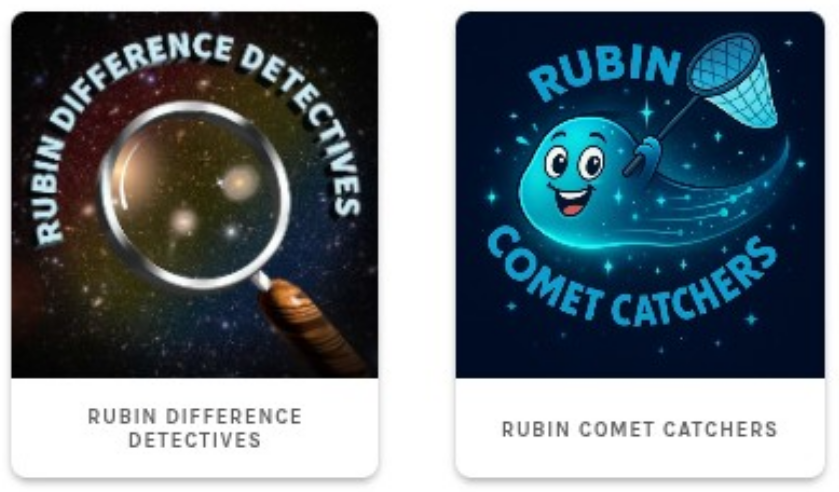

Colaborando en clasificación de imágenes del Observatorio Vera C. Rubin
===========

Fecha: 2026-02-05 20:30
Autor: Osvaldo
Categorías: Conferencias, Talleres, Astronomía, Zoouniverse, Ciencia Ciudadana, Durango

El 4 de febrero impartí la conferencia **Colaborando en clasificación de imágenes del Observatorio Vera C. Rubin** en el [Grupo Astronómico de Gómez Palacio](https://linktr.ee/grupoastronomicogp).

<!-- break -->

Al inicio se habló del [Observatorio Vera C. Rubin](https://rubinobservatory.org/) y del equipo que tiene para obtener imágenes como las obtenidas en el evento de su [First Look](https://rubinobservatory.org/es/news/rubin-first-look): la [trífida y la nebulosa de la laguna](https://rubinobservatory.org/es/gallery/collections/first-look-gallery/n4kvj0cemd5pbdqgtjdgp2jg2t) y el [cúmulo de Virgo](https://rubinobservatory.org/es/gallery/collections/first-look-gallery/0255d8op5l7nlfq7837och4v1v).

A continuación se explicó la importancia de la [ciencia ciudadana](https://es.wikipedia.org/wiki/Ciencia_ciudadana) y los detalles del proyecto [Zoouniverse](https://www.zooniverse.org/) (donde se habló, con fines inspiracionales, de la historia del descubrimiento del [objeto](https://es.wikipedia.org/wiki/Objeto_Hanny) [Hanny](https://en.wikipedia.org/wiki/Hanny%27s_Voorwerp))y como particiar en los proyectos que el [Observatorio Vera C. Rubin tiene en Zooniverse](https://www.zooniverse.org/organizations/rubinepo/rubin-observatory): [Rubin Difference Detectives](https://www.zooniverse.org/projects/ebellm/rubin-difference-detectives) y [Rubin Comet Catchers](https://www.zooniverse.org/projects/orionnau/rubin-comet-catchers).

 

### Descarga

[Aquí](2026-02-05-Colaborar-Clasificar-Imagenes-Observatorio-Vera-Rubin-Ciencia-Ciudadana/Clasificar_Vera_C_Rubin.pdf) se puede descargar la presentación.

 

