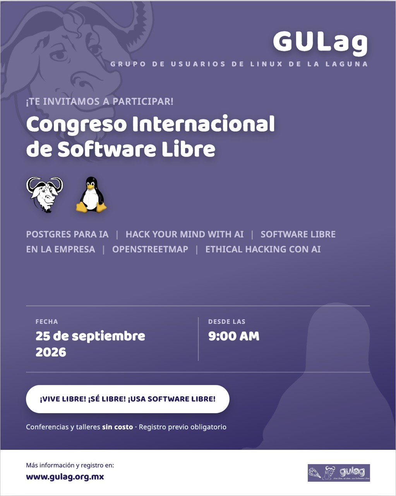
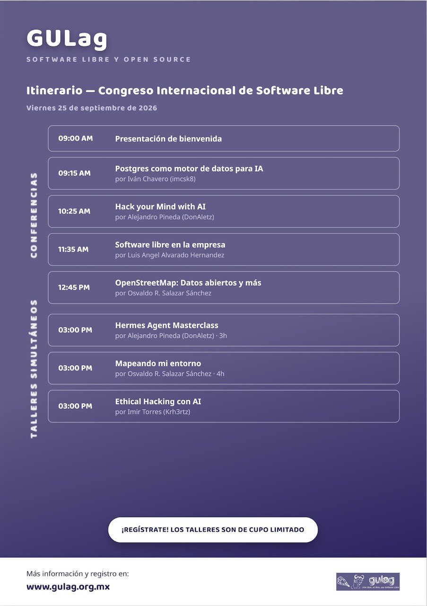

Congreso de Software Libre 2026
==================================

Fecha: 2026-09-02 08:00
Autor: Osvaldo
Categorías: OpenStreetMap, OSM, Software Libre, Free Software, Conferencias, Talleres, Coahuila

En breve celebraremos un aniversario más del [Grupo de Usuarios de GNU/Linux de La Laguna](http://www.gulag.org.mx/).

<!-- break -->

 

 

Lo celebraremos en la __Universidad Tecnológica de Torreón__ el __25 de septiembre__ desde las __9:00 horas__ con conferencias y talleres.

Toda la información la encontrarás en el sitio web del GULag [http://www.gulag.org.mx/proximamente-congreso-2025.html](http://www.gulag.org.mx/proximamente-congreso-2025.html)

 

 

Vienen invitados interesantes, uno de ellos es Iván Chavero.

Yo estaré dando una conferencia y un taller relacionados con OpenStreetMap.

### La Conferencia

En la conferencia __[OpenStreetMap: Datos abiertos y más](https://osmcal.org/event/5149/)__ se enseñará al público asistente qué es OpenStreetMap (OSM), qué son los datos abiertos y cómo y por qué usar ambos ya sea en nuestros trabajos, en nuestra comunidad y, principalmente, en nuestra vida diaria.

### El Taller de mapeo

En el taller __[Mapeando mi entorno](https://osmcal.org/event/5150/)__ se enseñará al público asistente a usar OpenStreetMap (OSM) para que puedan agregar a un mapa libre elementos que pueden enriquecer el mapa para todos quienes lo usamos.

 
Espero que todas las personas que conozcan y les interese el Software Libre nos puedan acompañar el __25 de septiembre__ desde las __9:00 horas__.

 
Recuerden: 😃🐧 ¡La entrada es Libre! 😃🐧

Fotos y más información en el sitio del [GULag](http://www.gulag.org.mx/).

